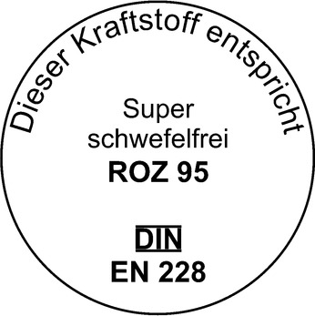
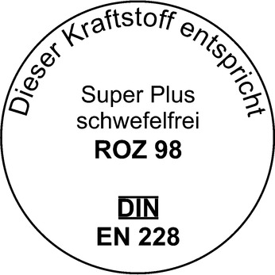
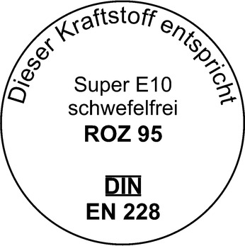
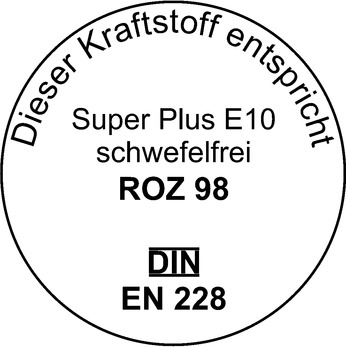
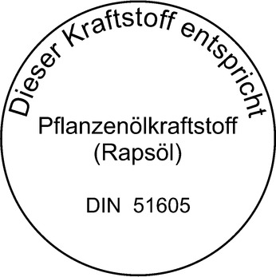
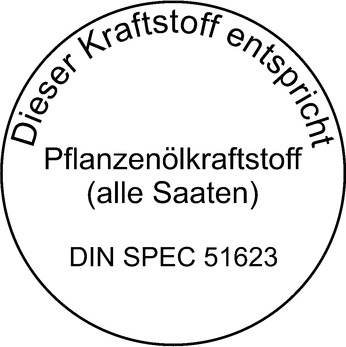

# Zehnte Verordnung zur Durchführung des Bundes-Immissionsschutzgesetzes (BImSchV 10 2010)

Ausfertigungsdatum
:   2010-12-08

Fundstelle
:   BGBl I: 2010, 1849

Geändert durch
:   Art. 1 V v. 1.12.2014 I 1890

[^F1_774781_BJNR184900010]:     Diese Verordnung dient der Umsetzung der:
    –                                    Richtlinie 98/70/EG des
    Europäischen Parlaments und des Rates vom 13. Oktober 1998 über die
    Qualität von Otto- und Dieselkraftstoffen und zur Änderung der
    Richtlinie 93/12/EWG des Rates (ABl. L 350 vom 28.12.1998, S. 58), die
    zuletzt durch die Richtlinie 2009/30/EG (ABl. L 140 vom 5.6.2009, S.
    88) geändert worden ist,

    –                                    Richtlinie 1999/32/EG des Rates
    vom 26. April 1999 über eine Verringerung des Schwefelgehalts
    bestimmter flüssiger Kraft- oder Brennstoffe und zur Änderung der
    Richtlinie 93/12/EWG (ABl. L 121 vom 11.5.1999, S. 13), die zuletzt
    durch die Richtlinie 2009/30/EG (ABl. L 140 vom 5.6.2009, S. 88)
    geändert worden ist.

[^F1_774781_01_BJNR184900010]: Die Verpflichtungen aus der Richtlinie 98/34/EG des Europäischen
Parlaments und des Rates vom 22. Juni 1998 über ein
Informationsverfahren auf dem Gebiet der Normen und technischen
Vorschriften und der Vorschriften für die Dienste der
Informationsgesellschaft (ABl. L 204 vom 21.7.1998, S. 37), die
zuletzt durch die Richtlinie 2006/96/EG (ABl. L 363 vom 20.12.2006, S.
81) geändert worden ist, sind beachtet worden.

## Eingangsformel

Es verordnen

–   die Bundesregierung auf Grund des § 34 Absatz 1 und 3 des Bundes-
    Immissionsschutzgesetzes in der Fassung der Bekanntmachung vom 26.
    September 2002 (BGBl. I S. 3830), von dem Absatz 3 durch Artikel 1
    Nummer 3 des Gesetzes vom 26. November 2010 (BGBl. I S. 1728)
    eingefügt worden ist, nach Anhörung der beteiligten Kreise, sowie auf
    Grund des § 34 Absatz 2 und des § 37 Satz 1 des Bundes-
    Immissionsschutzgesetzes und auf Grund des § 2a Absatz 3 des
    Benzinbleigesetzes, der durch Artikel 1 Nummer 3 des Gesetzes vom 25.
    November 1975 (BGBl. I S. 2919) eingefügt worden ist,

–   das Bundesministerium für Verkehr, Bau und Stadtentwicklung und das
    Bundesministerium für Umwelt, Naturschutz und Reaktorsicherheit im
    Einvernehmen mit dem Bundesministerium für Arbeit und Soziales auf
    Grund des § 3 Absatz 1 Nummer 2 Buchstabe a in Verbindung mit Absatz 2
    Nummer 2 und Absatz 5 Satz 1 und 2 des
    Binnenschifffahrtsaufgabengesetzes, von dem die Absätze 1 und 5
    zuletzt durch Artikel 313 Nummer 2 Buchstabe a und b der Verordnung
    vom 31. Oktober 2006 (BGBl. I S. 2407) geändert worden sind und Absatz
    2 durch Artikel 1 Nummer 3 Buchstabe b des Gesetzes vom 19. Juli 2005
    (BGBl. I S. 2186) geändert worden ist,

–   das Bundesministerium für Verkehr, Bau und Stadtentwicklung und das
    Bundesministerium für Umwelt, Naturschutz und Reaktorsicherheit nach
    Anhörung der beteiligten Kreise auf Grund des § 38 Absatz 2 des
    Bundes-Immissionsschutzgesetzes, der durch Artikel 60 Nummer 1 der
    Verordnung vom 31. Oktober 2006 (BGBl. I S. 2407) geändert worden ist:

## § 1 Begriffsbestimmungen

(1) Für diese Verordnung gelten die in den Absätzen 2 bis 15
geregelten Begriffsbestimmungen.

(2) „Ottokraftstoff“ ist jedes flüchtige Mineralölerzeugnis,
einschließlich der Zubereitungen mit einem Gehalt an Mineralöl von
mindestens 70 Gewichtshundertteilen, in denen diese Öle
Grundbestandteil sind, das

1.  unter die Unterpositionen 2710 12 41, 2710 12 45, 2710 12 49, 2710 12
    51 oder 2710 12 59 der Kombinierten Nomenklatur fällt und

2.  zum Betrieb von Fahrzeugverbrennungsmotoren mit Fremdzündung bestimmt
    ist.

(3) „Dieselkraftstoff“ ist jedes Gasölerzeugnis, einschließlich der
Zubereitungen mit einem Gehalt an Mineralöl von mindestens 70
Gewichtshundertteilen, in denen diese Öle Grundbestandteil sind, das

1.  unter die Unterpositionen 2710 20 11, 2710 20 15, 2710 20 17 (bis zu
    einem Schwefelgehalt von 0,05 Gewichtshundertteilen), 2710 19 43, 2710
    19 46 oder 2710 19 47 (bis zu einem Schwefelgehalt von 0,05
    Gewichtshundertteilen) der Kombinierten Nomenklatur fällt und

2.  verwendet wird zum Antrieb von Fahrzeugen im Sinne der Verordnungen

    a)  Verordnung (EG) Nr. 715/2007 des Europäischen Parlaments und des Rates
        vom 20. Juni 2007 über die Typgenehmigung von Kraftfahrzeugen
        hinsichtlich der Emissionen von leichten Personenkraftwagen und
        Nutzfahrzeugen (Euro 5 und Euro 6) und über den Zugang zu Reparatur-
        und Wartungsinformationen für Fahrzeuge (ABl. L 171 vom 29.6.2007, S.
        1), die zuletzt durch die Verordnung (EU) Nr. 459/2012 (ABl. L 142 vom
        1\.6.2012, S. 16) geändert worden ist, sowie

    b)  Verordnung (EG) Nr. 595/2009 des Europäischen Parlaments und des Rates
        vom 18. Juni 2009 über die Typgenehmigung von Kraftfahrzeugen und
        Motoren hinsichtlich der Emissionen von schweren Nutzfahrzeugen (Euro
        VI) und über den Zugang zu Fahrzeugreparatur- und
        -wartungsinformationen, zur Änderung der Verordnung (EG) Nr. 715/2007
        und der Richtlinie 2007/46/EG sowie zur Aufhebung der Richtlinien
        80/1269/EWG, 2005/55/EG und 2005/78/EG (ABl. L 188 vom 18.7.2009, S.
        1, L 200 vom 31.7.2009, S. 52), die zuletzt durch die Verordnung (EU)
        Nr. 133/2014 (ABl. L 47 vom 18.2.2014, S. 1) geändert worden ist.

(4) Dieselkraftstoff zur Verwendung für mobile Maschinen und Geräte,
für land- und forstwirtschaftliche Zugmaschinen sowie für
Binnenschiffe und Sportboote, ist jeder aus Erdöl gewonnene flüssige
Kraftstoff, einschließlich der Zubereitungen mit einem Gehalt an
Mineralöl von mindestens 70 Gewichtshundertteilen, in denen diese Öle
der Grundbestandteil sind, der

1.  unter die Unterpositionen 2710 20 11, 2710 20 15, 2710 20 17 (bis zu
    einem Schwefelgehalt von 0,05 Gewichtshundertteilen), 2710 19 43, 2710
    19 46 oder 2710 19 47 (bis zu einem Schwefelgehalt von 0,05
    Gewichtshundertteilen) der Kombinierten Nomenklatur fällt und

2.  für den Betrieb in von Kompressionszündungsmotoren bestimmt ist, die
    in den folgenden Richtlinien genannt werden:

    a)  Richtlinie 94/25/EG des Europäischen Parlaments und des Rates vom 16.
        Juni 1994 zur Angleichung der Rechts- und Verwaltungsvorschriften der
        Mitgliedstaaten über Sportboote (ABl. L 164 vom 30.6.1994, S. 15), die
        zuletzt durch die Verordnung (EU) Nr. 1025/2012 (ABl. L 316 vom
        14\.11.2012, S. 12) geändert worden ist,

    b)  Richtlinie 97/68/EG des Europäischen Parlaments und des Rates vom 16.
        Dezember 1997 zur Angleichung der Rechtsvorschriften der
        Mitgliedstaaten über Maßnahmen zur Bekämpfung der Emission von
        gasförmigen Schadstoffen und luftverunreinigenden Partikeln aus
        Verbrennungsmotoren für mobile Maschinen und Geräte (ABl. L 59 vom
        27\.2.1998, S. 1), die zuletzt durch die Richtlinie 2012/46/EU (ABl. L
        353 vom 21.12.2012, S. 80) geändert worden ist, oder

    c)  Richtlinie 2000/25/EG des Europäischen Parlaments und des Rates vom
        22\. Mai 2000 über Maßnahmen zur Bekämpfung der Emission gasförmiger
        Schadstoffe und luftverunreinigender Partikel aus Motoren, die für den
        Antrieb von land- und forstwirtschaftlichen Zugmaschinen bestimmt
        sind, und zur Änderung der Richtlinie 74/150/EWG des Rates (ABl. L 173
        vom 12.7.2000, S. 1), die zuletzt durch die Richtlinie 2013/15/EU
        (ABl. L 158 vom 10.6.2013, S. 172) geändert worden ist.

(5) „Schiffskraftstoff“ ist jeder aus Erdöl gewonnene flüssige Kraft-
oder Brennstoff, der zur Verwendung auf einem Schiff bestimmt ist oder
auf einem Schiff verwendet wird, einschließlich Kraft-oder
Brennstoffen im Sinne der Definition nach DIN ISO 8217, Ausgabe
Dezember 2013.

(6) „Gasöl für den Seeverkehr“ ist jeder Schiffskraftstoff gemäß der
Definition der Güteklassen DMX, DMA und DMZ nach Tabelle 1 der DIN ISO
8217, Ausgabe Dezember 2013, ohne Berücksichtigung des
Schwefelgehalts.

(7) „Schiffsdiesel“ ist jeder Schiffskraftstoff gemäß der Definition
der Güteklasse DMB nach Tabelle 1 der DIN ISO 8217, Ausgabe Dezember
2013, ohne Berücksichtigung des Schwefelgehalts.

(8) „Sonstige Schiffskraftstoffe“ sind die nicht in den Absätzen 6 und
7 genannten Schiffskraftstoffe.

(9) „Leichtes Heizöl“ ist jedes Erdölerzeugnis, einschließlich der
Zubereitungen, die Komponenten aus Synthese oder Hydrotreatment oder
Komponenten biogener Herkunft enthalten, mit Ausnahme der in den
Absätzen 3 bis 8 genannten Kraft- und Brennstoffe, das nach dem
Prüfverfahren der DIN EN ISO 3405, Ausgabe August 2001, bei 350 Grad
Celsius mindestens 85 oder bei 360 Grad Celsius mindestens 95
Raumhundertteile Destillat ergibt.

(10) „Schweres Heizöl“ ist jeder aus Erdöl gewonnene flüssige Kraft-
oder Brennstoff mit Ausnahme der in den Absätzen 3 bis 9 genannten
Kraft- und Brennstoffe, der nach dem Prüfverfahren der DIN EN ISO
3405, Ausgabe August 2001, bei 250 Grad Celsius weniger als 65
Raumhundertteile Destillat ergibt.

(11) „Einführer“ ist, wer Kraft- oder Brennstoffe gewerbsmäßig oder im
Rahmen wirtschaftlicher Unternehmungen einführt.

(12) „Vermischer“ ist, wer Kraft- oder Brennstoffe gewerbsmäßig oder
im Rahmen wirtschaftlicher Unternehmungen vermischt oder die
Vermischung veranlasst.

(13) „Großverteiler“ ist, wer Kraft- oder Brennstoffe gewerbsmäßig
oder im Rahmen wirtschaftlicher Unternehmungen verteilt und über eine
Lagerkapazität von mehr als 1 000 Kubikmeter verfügt. Das Verteilen
nach Satz 1 schließt die Abgabe an Schiffe ein.

(14) „Inverkehrbringen“ ist jedes Überlassen an andere.

(15) „Kombinierte Nomenklatur“ ist die Warennomenklatur nach Artikel 1
der Verordnung (EWG) Nr. 2658/87 des Rates vom 23. Juli 1987 über die
zolltarifliche und statistische Nomenklatur sowie den Gemeinsamen
Zolltarif (ABl. L 256 vom 7.9.1987, S. 1, L 341 vom 3.12.1987, S. 38,
L 378 vom 31.12.1987, S. 120, L 130 vom 26.5.1988, S. 42), die zuletzt
durch die Verordnung (EU) Nr. 1001/2013 (ABl. L 290 vom 31.10.2013, S.
1) geändert worden ist, in der am 1. Januar 2014 geltenden Fassung.

## § 2 Chlor- und Bromverbindungen

(1) Kraftstoffe für Kraftfahrzeuge im Sinne des § 1 Absatz 2 des
Straßenverkehrsgesetzes dürfen nur dann gewerbsmäßig oder im Rahmen
wirtschaftlicher Unternehmungen in den Verkehr gebracht werden, wenn
sie keine Chlor- oder Bromverbindungen als Zusatz enthalten.

(2) Chlor- oder Bromverbindungen als Zusatz zu Kraftstoffen nach
Absatz 1 dürfen gewerbsmäßig oder im Rahmen wirtschaftlicher
Unternehmungen nicht in den Verkehr gebracht werden.

(3) Die Absätze 1 und 2 gelten nicht für das Inverkehrbringen zum
Zweck der Forschung, Entwicklung oder Analyse.

## § 3 Anforderungen an Ottokraftstoffe; Bestandsschutzsortenregelung

(1) Ottokraftstoff darf nur dann gewerbsmäßig oder im Rahmen
wirtschaftlicher Unternehmungen gegenüber dem Letztverbraucher in den
Verkehr gebracht werden, wenn er den Anforderungen der DIN EN 228,
Ausgabe Oktober 2014, genügt.

(2) Wer Ottokraftstoffe nach Absatz 1 der Qualität „Super“ mit mehr
als 5 Volumenprozent Ethanol anbietet, ist verpflichtet, an derselben
Abgabestelle auch Ottokraftstoffe nach Absatz 1 der Qualität „Super“
mit einem maximalen Sauerstoffgehalt von 2,7 Massenprozent und einem
maximalen Ethanolgehalt von 5 Volumenprozent anzubieten.

(3) Wer Ottokraftstoffe nach Absatz 1 der Qualität „Super Plus“ mit
mehr als 5 Volumenprozent Ethanol anbietet, ist verpflichtet, an
derselben Abgabestelle auch Ottokraftstoffe nach Absatz 1 der Qualität
„Super Plus“ mit einem maximalen Sauerstoffgehalt von 2,7
Massenprozent und einem maximalen Ethanolgehalt von 5 Volumenprozent
anzubieten.

(4) An Abgabestellen, an denen im Durchschnitt der zwei jeweils
vorangegangenen Kalenderjahre weniger als 500 Kubikmeter
Ottokraftstoffe nach Absatz 1 in den Verkehr gebracht wurden, gelten
die Verpflichtungen nach Absatz 2 und Absatz 3 nicht. Die
Voraussetzungen des Satzes 1 sind durch geeignete Belege gegenüber der
zuständigen Behörde auf Verlangen nachzuweisen.

## § 4 Anforderungen an Dieselkraftstoff, Gasöl und andere flüssige Kraftstoffe; Schwefelgehalt

(1) Dieselkraftstoff darf nur dann gewerbsmäßig oder im Rahmen
wirtschaftlicher Unternehmungen gegenüber dem Letztverbraucher in den
Verkehr gebracht werden, wenn er den Anforderungen der DIN EN 590,
Ausgabe April 2014, genügt.

(2) Dieselkraftstoff zur Verwendung für mobile Maschinen und Geräte,
für land- und forstwirtschaftliche Zugmaschinen sowie für
Binnenschiffe und Sportboote darf nur dann gewerbsmäßig oder im Rahmen
wirtschaftlicher Unternehmungen gegenüber dem Letztverbraucher in den
Verkehr gebracht werden, wenn sein Gehalt an Schwefelverbindungen,
berechnet als Schwefel, 10 Milligramm pro Kilogramm Dieselkraftstoff
nicht überschreitet. Für Binnenschiffe und Sportboote dürfen andere
flüssige Kraftstoffe nicht verwendet werden, es sei denn ihr
Schwefelgehalt überschreitet den für Dieselkraftstoff nach Satz 1
zulässigen Schwefelgehalt nicht.

(3) Gasöl für den Seeverkehr darf nur dann gewerbsmäßig oder im Rahmen
wirtschaftlicher Unternehmungen gegenüber dem Letztverbraucher in den
Verkehr gebracht werden, wenn sein Gehalt an Schwefelverbindungen,
berechnet als Schwefel, 1,0 Gramm pro Kilogramm Gasöl für den
Seeverkehr nicht überschreitet.

(4) Schiffsdiesel darf nur dann gewerbsmäßig oder im Rahmen
wirtschaftlicher Unternehmungen gegenüber dem Letztverbraucher in den
Verkehr gebracht werden, wenn sein Gehalt an Schwefelverbindungen,
berechnet als Schwefel, 15,0 Gramm pro Kilogramm Schiffsdiesel nicht
überschreitet.

## § 5 Anforderungen an Biodiesel

Biodiesel darf nur dann gewerbsmäßig oder im Rahmen wirtschaftlicher
Unternehmungen gegenüber dem Letztverbraucher in den Verkehr gebracht
werden, wenn er den Anforderungen der DIN EN 14214, Ausgabe Juni 2014,
genügt. Das gilt auch für Biodiesel als Zusatz zum Dieselkraftstoff.

## § 6 Anforderungen an Ethanolkraftstoff (E85)

Ethanolkraftstoff (E85) darf nur dann gewerbsmäßig oder im Rahmen
wirtschaftlicher Unternehmungen als Kraftstoff gegenüber dem
Letztverbraucher in den Verkehr gebracht werden, wenn er den
Anforderungen der DIN 51625, Ausgabe August 2008, genügt.

## § 7 Anforderungen an Flüssiggaskraftstoff

Flüssiggaskraftstoff darf nur dann gewerbsmäßig oder im Rahmen
wirtschaftlicher Unternehmungen gegenüber dem Letztverbraucher in den
Verkehr gebracht werden, wenn er den Anforderungen der DIN EN 589,
Ausgabe Juni 2012, genügt.

## § 8 Anforderungen an Erdgas und Biogas als Kraftstoffe

(1) Erdgas und Biogas dürfen nur dann gewerbsmäßig oder im Rahmen
wirtschaftlicher Unternehmungen als Kraftstoffe gegenüber dem
Letztverbraucher in den Verkehr gebracht werden, wenn sie den
jeweiligen Anforderungen der DIN 51624, Ausgabe Februar 2008, genügen.

(2) Erdgas und Biogas dürfen nur dann, in jedem Verhältnis gemischt,
als Kraftstoff gewerbsmäßig oder im Rahmen wirtschaftlicher
Unternehmungen gegenüber dem Letztverbraucher in den Verkehr gebracht
werden, wenn das fertige Produkt den Anforderungen der DIN 51624,
Ausgabe Februar 2008, genügt.

## § 9 Anforderung an Pflanzenölkraftstoffe

(1) Pflanzenölkraftstoff – Rapsöl – darf nur dann gewerbsmäßig oder im
Rahmen wirtschaftlicher Unternehmungen gegenüber dem Letztverbraucher
in den Verkehr gebracht werden, wenn er den Anforderungen der DIN
51605, Ausgabe September 2010, genügt.

(2) Pflanzenölkraftstoff – alle Saaten – darf nur dann gewerbsmäßig
oder im Rahmen wirtschaftlicher Unternehmungen gegenüber dem
Letztverbraucher in den Verkehr gebracht werden, wenn er den
Anforderungen der DIN SPEC 51623, Ausgabe Juni 2012, genügt.

## § 10 Schwefelgehalt von Heizöl

(1) Leichtes Heizöl darf nur dann gewerbsmäßig oder im Rahmen
wirtschaftlicher Unternehmungen gegenüber dem Letztverbraucher in den
Verkehr gebracht werden, wenn sein Gehalt an Schwefelverbindungen,
berechnet als Schwefel, 1,0 Gramm pro Kilogramm leichtes Heizöl nicht
überschreitet.

(2) Schweres Heizöl darf nur dann gewerbsmäßig oder im Rahmen
wirtschaftlicher Unternehmungen gegenüber dem Letztverbraucher in den
Verkehr gebracht werden, wenn sein Gehalt an Schwefelverbindungen,
berechnet als Schwefel, von 10,0 Gramm pro Kilogramm schweres Heizöl
nicht überschritten wird. Schweres Heizöl mit höheren Schwefelgehalten
darf nur dann gewerbsmäßig oder im Rahmen wirtschaftlicher
Unternehmungen gegenüber dem Letztverbraucher in den Verkehr gebracht
werden, soweit dieses Heizöl:

1.  in Übereinstimmung mit den Anforderungen der Verordnung über
    Großfeuerungs-, Gasturbinen- und Verbrennungsmotoranlagen oder

2.  in Übereinstimmung mit den Anforderungen zur Vorsorge gegen schädliche
    Umwelteinwirkungen der Technischen Anleitung zur Reinhaltung der Luft
    vom 24. Juli 2002 (GMBl. 2002 S. 511) in Verbrennungseinrichtungen
    eingesetzt werden darf und sichergestellt ist, dass die maximalen
    Schwefeldioxidemissionen von 1 700 Milligramm Schwefeldioxid pro
    Normkubikmeter schwerem Heizöl bei einem Sauerstoffgehalt des
    Rauchgases von 3 Volumeneinheiten im trockenen Bezugszustand nicht
    überschritten werden.

## § 11 Gleichwertigkeitsklausel

Den Kraftstoffen nach § 3 und § 4 Absatz 1 sowie den §§ 5 bis 9 sind
solche Kraftstoffe gleichgestellt, die den Anforderungen anderer
Normen oder technischer Spezifikationen genügen, die in einem anderen
Mitgliedstaat der Europäischen Union oder einem anderen Vertragsstaat
des Abkommens über den Europäischen Wirtschaftsraum oder in der Türkei
oder einem anderen Mitglied der Welthandelsorganisation in Kraft sind,
sofern

1.  diese Normen oder technischen Spezifikationen mit einer der folgenden
    Normen übereinstimmen:

    a)  DIN EN 228, Ausgabe Oktober 2014,

    b)  DIN EN 590, Ausgabe April 2014,

    c)  DIN EN 14214, Ausgabe Juni 2014,

    d)  DIN 51625, Ausgabe August 2008,

    e)  DIN EN 589, Ausgabe Juni 2012,

    f)  DIN 51624, Ausgabe Februar 2008,

    g)  DIN 51605, Ausgabe September 2010, oder

    h)  DIN SPEC 51623, Ausgabe Juni 2012, und

2.  die Kraftstoffe die klimatischen Anforderungen erfüllen, die in den
    unter Nummer 1 angegebenen Normen für die Bundesrepublik Deutschland
    festgelegt sind.

## § 12 Einschränkungen

(1) Für Kraft- und Brennstoffe nach § 1 Absatz 4 bis 10, die
eingeführt oder sonst in den Geltungsbereich dieser Verordnung
verbracht werden und die unter diese Verordnung fallen, sind § 4
Absatz 2 bis 4 und § 10 erst von dem Zeitpunkt an anzuwenden, an dem
sie in den zollrechtlich freien Verkehr überführt werden.

(2) Die in dieser Verordnung festgelegten Grenzwerte für den
Schwefelgehalt bestimmter flüssiger Kraft- oder Brennstoffe, die aus
Erdöl gewonnen werden, gelten nicht für Kraft- oder Brennstoffe zur
Verwendung auf Kriegsschiffen und anderen zu militärischen Zwecken
eingesetzten Schiffen.

## § 13 Auszeichnung von Kraft- und Brennstoffen

(1) Wer gewerbsmäßig oder im Rahmen wirtschaftlicher Unternehmungen
gegenüber dem Letztverbraucher Kraftstoffe in den Verkehr bringt, hat
die Qualität an den Zapfsäulen sowie an der Tankstelle in folgender
Weise deutlich sichtbar zu machen:

1.  Schwefelfreier Ottokraftstoff mit einem maximalen Sauerstoffgehalt von
    2,7 Massenprozent und einem maximalen Ethanolgehalt von 5
    Volumenprozent, der den Anforderungen der DIN EN 228, Ausgabe Oktober
    2014, genügt oder gleichwertig nach § 11 ist, wird mit der Bezeichnung
    „Super schwefelfrei“ oder „Super Plus schwefelfrei“ und dem jeweils
    zutreffenden Zeichen nach Anlage 1a oder 1b gekennzeichnet; an den
    Zapfsäulen ist zusätzlich der Hinweis „Enthält bis zu 5 % Bioethanol“
    deutlich sichtbar anzubringen.

2.  Schwefelfreier Ottokraftstoff, der den Anforderungen der DIN EN 228,
    Ausgabe Oktober 2014, genügt oder gleichwertig nach § 11 ist und
    dessen Sauerstoffgehalt 2,7 Massenprozent oder dessen Ethanolgehalt 5
    Volumenprozent überschreiten kann, wird mit der Bezeichnung „Super E10
    schwefelfrei“ oder „Super Plus E10 schwefelfrei“ und dem jeweils
    zutreffenden Zeichen nach Anlage 2a oder 2b gekennzeichnet; an den
    Zapfsäulen sind zusätzlich die Hinweise „Enthält bis zu 10 %
    Bioethanol“ und „Verträgt Ihr Fahrzeug E10? Herstellerinformation
    einholen! Im Zweifel Super oder Super Plus tanken!“ deutlich sichtbar
    anzubringen.

3.  Dieselkraftstoff, der den Anforderungen der DIN EN 590, Ausgabe April
    2014, genügt oder gleichwertig nach § 11 ist, wird mit der Bezeichnung
    „Dieselkraftstoff schwefelfrei“ und dem Zeichen nach Anlage 3
    gekennzeichnet; an den Zapfsäulen ist zusätzlich der Hinweis „Enthält
    bis zu 7 % Biodiesel“ deutlich sichtbar anzubringen.

4.  Fettsäure-Methylester für Dieselmotoren, die den Anforderungen der DIN
    EN 14214, Ausgabe Juni 2014, genügen oder gleichwertig nach § 11 sind,
    werden mit der Bezeichnung „Biodiesel“ und dem Zeichen nach Anlage 4
    gekennzeichnet.

5.  Ethanol für Kraftfahrzeuge, das den Anforderungen der DIN 51625,
    Ausgabe August 2008, genügt oder gleichwertig nach § 11 ist, wird mit
    der Bezeichnung „Ethanolkraftstoff (E85)“ und dem Zeichen nach Anlage
    5 gekennzeichnet.

6.  Flüssiggaskraftstoff, der den Anforderungen der DIN EN 589, Ausgabe
    Juni 2012, genügt oder gleichwertig nach § 11 ist, wird mit der
    Bezeichnung „Flüssiggas“ und dem Zeichen nach Anlage 6 gekennzeichnet.

7.  Erdgaskraftstoffe, die den Anforderungen der DIN 51624, Ausgabe
    Februar 2008, genügen oder gleichwertig nach § 11 sind, werden mit der
    Bezeichnung „Erdgas H“ oder „Erdgas L“ und dem jeweils zutreffenden
    Zeichen nach Anlage 7a oder 7b gekennzeichnet.

8.  Pflanzenölkraftstoff, der den Anforderungen der DIN 51605, Ausgabe
    September 2010, genügt oder gleichwertig nach § 11 ist, wird mit der
    Bezeichnung „Pflanzenölkraftstoff – Rapsöl –“ und dem Zeichen nach
    Anlage 8a gekennzeichnet.

9.  Pflanzenölkraftstoff, der den Anforderungen der DIN SPEC 51623,
    Ausgabe Juni 2012, genügt oder gleichwertig nach § 11 ist, wird mit
    der Bezeichnung „Pflanzenölkraftstoff – alle Saaten –“ und dem Zeichen
    nach Anlage 8b gekennzeichnet.

(2) Wer gewerbsmäßig oder im Rahmen wirtschaftlicher Unternehmungen
gegenüber dem Letztverbraucher Kraftstoffe mit metallhaltigen Zusätzen
in den Verkehr bringt, hat dort, wo die Informationen nach Absatz 1
angezeigt werden, die folgende Kennzeichnung anzubringen: „Enthält
metallhaltige Zusätze. Fragen Sie Ihren Fahrzeughersteller, ob diese
Zusätze für Ihr Fahrzeug geeignet sind. Verwenden Sie im Zweifelsfall
Kraftstoff ohne metallhaltige Zusätze. “ Die Kennzeichnung muss durch
ihre Größe deutlich sichtbar sein und ihre Schriftart muss gut lesbar
sein.

(3) Leichtes Heizöl, das nach § 10 Absatz 1 in den Verkehr gebracht
wird, kann als „schwefelarm“ bezeichnet werden, wenn sein
Schwefelgehalt 50 Milligramm pro Kilogramm leichtes Heizöl nicht
überschreitet.

(4) Die Absätze 1 und 2 finden keine Anwendung im Bereich der Kraft-
und Brennstoffe nach § 1 Absatz 4 bis 10.

## § 14 Nachweisführung

(1) Wer gewerbsmäßig oder im Rahmen einer wirtschaftlichen
Unternehmung Kraftstoffe in den Verkehr bringt, hat den nach § 13
Auszeichnungspflichtigen bei Anlieferung der Ware darüber zu
unterrichten, dass die Kraftstoffe

1.  den in den § 3 und § 4 Absatz 1 sowie in den §§ 5 bis 9 genannten
    Anforderungen genügen oder

2.  nach § 11 gleichwertig sind.

Die Unterrichtung erfolgt schriftlich. Sie kann für jede einzelne
Lieferung separat vorgenommen werden oder für mehrere zeitlich
aufeinander folgende Lieferungen; in diesem Fall ist sie bei der
ersten Lieferung vorzunehmen.

(2) Auskunftspflichtige nach § 52 Absatz 3 Satz 1 in Verbindung mit
Absatz 2 Satz 1 des Bundes-Immissionsschutzgesetzes, die Kraft- und
Brennstoffe nach § 1 Absatz 4 bis 10 als Hersteller, Vermischer,
Einführer oder Großverteiler lagern, haben Tankbelegbücher zu führen
und auf Verlangen vorzulegen, aus denen hervorgeht, welche Lieferanten
den Kraft- und Brennstoff geliefert haben.

## § 15 Bekanntmachung der Kraftstoffqualität für den Betrieb von Kraftfahrzeugen

(1) Wer gewerbsmäßig oder im Rahmen einer wirtschaftlichen
Unternehmung Kraftfahrzeuge herstellt oder einführt, hat für den
Betrieb der Kraftfahrzeuge, die er in den Verkehr bringt, die
empfohlenen und verwendbaren Kraftstoffqualitäten

1.  den Vertragswerkstätten und -händlern sowie der Öffentlichkeit in
    geeigneter Weise bekannt zu geben und

2.  in den Betriebsanleitungen oder anderen für den Kraftfahrzeughalter
    bestimmten Unterlagen anzugeben.

(2) Um die Verpflichtungen nach Absatz 1 zu erfüllen, genügt es, dass
die Bezeichnungen nach § 13 für die Qualität der Kraftstoffe verwendet
werden. Auf die Zeichen nach den Anlagen 1a bis 8b kann verzichtet
werden.

## § 16 Ausnahmen

(1) Die zuständige Behörde kann auf Antrag Ausnahmen von den
Anforderungen der § 3, § 4 Absatz 1 sowie §§ 5 bis 9 bewilligen,
soweit dies in besonderen Einzelfällen zu Forschungs- und
Erprobungszwecken erforderlich ist und schädliche Umwelteinwirkungen
nicht zu erwarten sind. Die Bewilligung ist zu befristen.

(2) Keine Ausnahmebewilligung nach Absatz 1 Satz 1 ist erforderlich
für Kraftstoffe, die betriebsintern zu Forschungs- und
Erprobungszwecken verwandt und nicht über öffentliche Tankstellen in
den Verkehr gebracht werden und die keine schädlichen
Umwelteinwirkungen erwarten lassen.

(3) Die zuständige Behörde bewilligt im Benehmen mit dem Bundesamt für
Wirtschaft und Ausfuhrkontrolle auf Antrag Ausnahmen von § 4 Absatz 2
bis 4 und § 10 für Kraft- und Brennstoffe nach § 1 Absatz 4 bis 10,
soweit die Einhaltung des zulässigen Höchstgehalts an
Schwefelverbindungen zu einer erheblichen Gefährdung der Versorgung
des Verbrauchers mit Kraft- und Brennstoffen nach § 1 Absatz 4 bis 10
führen würde. Die Bewilligungen können unter Bedingungen erteilt und
mit Auflagen verbunden werden.Die Bewilligungen sind zu befristen. Sie
können widerrufen werden, wenn die Voraussetzungen für ihre Erteilung
nicht mehr vorliegen.

## § 17 Zugänglichkeit der Normen

DIN-, DIN EN- und DIN SPEC, ISO-, DIN ISO- und DIN EN ISO-Normen, auf
die in dieser Verordnung verwiesen wird, sind bei der Beuth-Verlag
GmbH, Berlin und Köln, erschienen. Das in § 18 Absatz 1 genannte DVGW-
Arbeitsblatt ist bei der Wirtschafts- und Verlagsgesellschaft Gas und
Wasser mbH, Bonn, erschienen. Die DIN-, DIN EN- und DIN SPEC, ISO-,
DIN ISO- und DIN EN ISO-Normen und das DVGW-Arbeitsblatt sind beim
Deutschen Patent- und Markenamt in München archivmäßig gesichert
niedergelegt.

## § 18 Überwachung

(1) Die zuständigen Behörden überwachen die in den §§ 3 bis 9
gestellten Anforderungen an Kraftstoffe sowie die in § 13 gestellten
Anforderungen an die Auszeichnungspflicht dieser Kraftstoffe anhand
der in den §§ 3 bis 9 genannten DIN-, DIN EN- und DIN SPEC-Normen
angegebenen Prüfverfahren und nach den in DIN EN 14274, Ausgabe Mai
2013, DIN 51750 Teil 1, Ausgabe Dezember 1990, und Teil 2, Ausgabe
Dezember 1990, DIN 51610, Ausgabe Juni 1983 sowie in dem DVGW
Arbeitsblatt G 264, Ausgabe Mai 2009, vorgeschriebenen Verfahren.
Abweichend von den Angaben in DIN EN 590, Ausgabe April 2014, und DIN
EN 14214, Ausgabe Juni 2014, findet für die Bestimmung der
Gesamtverschmutzung bei der Überprüfung des in Verkehr gebrachten
Kraftstoffes die Prüfmethode nach DIN EN 12662, Ausgabe Juli 2008,
weiterhin Anwendung.

(2) Der Auszeichnungspflichtige nach § 13 hat auf Verlangen der
zuständigen Behörde den nach § 14 Absatz 1 erhaltenen
Unterrichtungsnachweis vorzulegen. Auskunftspflichtige nach § 14
Absatz 2, die Kraft- und Brennstoffe nach § 1 Absatz 4 bis 10 lagern,
haben auf Verlangen der zuständigen Behörde eine Erklärung des
Herstellers oder Vermischers über die Beschaffenheit dieser Kraft-
oder Brennstoffe vorzulegen. Sofern der Hersteller oder Vermischer
nicht selbst geliefert hat, muss die Erklärung zusätzlich Angaben des
Lieferanten über die gelieferte Menge enthalten. Für die Erklärung ist
ein Vordruck nach dem Muster der Anlage 9 zu verwenden. Die zuständige
Behörde kann dem Auskunftspflichtigen für die Vorlage der Erklärung
eine Frist setzen.

(3) Die zuständigen Behörden überwachen durch Probenahmen, ob der
Schwefelgehalt der verwendeten und der in Verkehr gebrachten Kraft-
und Brennstoffe den Anforderungen nach § 4 Absatz 2 bis 4 und nach §
10 entspricht. Die Probenahmen müssen mit ausreichender Häufigkeit und
ausreichenden Mengen vorgenommen werden, so dass die Ergebnisse für
den geprüften Kraft- und Brennstoff repräsentativ sind.

(4) Der Schwefelgehalt in Dieselkraftstoff zur Verwendung für mobile
Maschinen und Geräte, für land- und forstwirtschaftliche Zugmaschinen
sowie für Binnenschiffe und Sportboote ist im Rahmen der Überwachung
nach Absatz 3 durch eines der folgenden Prüfverfahren zu bestimmen:

1.  nach DIN EN ISO 20846, Ausgabe Januar 2012,

2.  nach DIN EN ISO 20884, Ausgabe Juli 2011, oder

3.  nach DIN EN ISO 13032, Ausgabe Juni 2012.

Als Referenzverfahren dient das Prüfverfahren nach DIN EN ISO 20846,
Ausgabe Januar 2012, oder nach DIN EN ISO 20884, Ausgabe Juli 2011.

(5) Für die Bestimmung des Schwefelgehalts in leichtem Heizöl ist im
Rahmen der Überwachung nach Absatz 3 eines der folgenden Prüfverfahren
zu verwenden:

1.  nach DIN EN ISO 8754, Ausgabe Dezember 2003, oder

2.  nach DIN EN ISO 14596, Ausgabe Dezember 2007.

Als Referenzverfahren dient das Prüfverfahren nach ISO 8754, Ausgabe
Dezember 2003.
Bei leichtem Heizöl, das zusätzlich nach § 13 Absatz 3 mit dem Begriff
„schwefelarm“ ausgezeichnet ist, ist eines der folgenden Prüfverfahren
zu verwenden:

1.  nach DIN EN ISO 20846, Ausgabe Januar 2012, oder

2.  nach DIN EN ISO 20884, Ausgabe Juli 2011.

(6) Für die Bestimmung des Schwefelgehalts in schwerem Heizöl ist im
Rahmen der Überwachung nach Absatz 3 eines der folgenden Prüfverfahren
zu verwenden:

1.  nach DIN 51400-3, Ausgabe Juni 2001,

2.  nach DIN EN ISO 8754, Ausgabe Dezember 2003, oder

3.  nach DIN EN ISO 14596, Ausgabe Dezember 2007.

Als Referenzverfahren dient das Prüfverfahren nach DIN EN ISO 14596,
Ausgabe Dezember 2007.

(7) Für die Bestimmung des Schwefelgehalts in Gasöl für den
Seeverkehr, für Schiffsdiesel und für sonstige Schiffskraftstoffe nach
§ 1 Absatz 8 ist im Rahmen der Überwachung nach Absatz 3 eines der
folgenden Prüfverfahren zu verwenden:

1.  nach DIN EN ISO 8754, Ausgabe Dezember 2003, oder

2.  nach DIN EN ISO 14596, Ausgabe Dezember 2007.

Als Referenzverfahren dient das Prüfverfahren nach DIN EN ISO 8754,
Ausgabe Dezember 2003.

(8) Die nach Landesrecht zuständigen obersten Landesbehörden oder die
von ihnen bestimmten Behörden übermitteln dem Umweltbundesamt bis
spätestens zum 30. April eine jährliche Übersicht der
Überwachungsergebnisse nach Absatz 1 und 3 zur Weiterleitung an die
Europäische Kommission.

## § 19 Einfuhr von Heizöl, Schiffskraftstoff und Dieselkraftstoff

(1) Der Einführer von Kraft- und Brennstoffen nach § 1 Absatz 4 bis 10
hat der für den ersten Bestimmungsort zuständigen Behörde die Sendung
so rechtzeitig zu melden, dass die Behörde vor dem Eintreffen der
Sendung am ersten Bestimmungsort davon Kenntnis erhält.

(2) Der Einführer von Kraft- und Brennstoffen nach § 1 Absatz 4 bis 10
hat die für die Zollabfertigung vom Einführer vorgelegten Qualitäts-
oder Analysezertifikate am ersten Bestimmungsort der Sendung verfügbar
zu halten, solange sich die Sendung oder Teile der Sendung dort
befinden. Der Einführer hat die Qualitäts- oder Analysezertifikate ab
dem Zeitpunkt des Eintreffens der Sendung am ersten Bestimmungsort
mindestens ein Jahr aufzubewahren.

(3) Die Absätze 1 und 2 sind nicht anzuwenden beim Verbringen aus
Staaten der Europäischen Union.

## § 20 Ordnungswidrigkeiten

(1) Ordnungswidrig im Sinne des § 62 Absatz 1 Nummer 7 des Bundes-
Immissionsschutzgesetzes handelt, wer vorsätzlich oder fahrlässig

1.  entgegen

    a)  § 2 Absatz 1, § 4 Absatz 2 Satz 1, Absatz 3 oder Absatz 4 oder § 10
        Absatz 1 oder Absatz 2 Satz 1 oder

    b)  § 3 Absatz 1, § 4 Absatz 1, §§ 5 bis 8 oder § 9, jeweils auch in
        Verbindung mit § 11,

    einen Brenn- oder Kraftstoff in den Verkehr bringt,

2.  entgegen § 2 Absatz 2 Chlor- oder Bromverbindungen als Zusatz zu
    Kraftstoffen in den Verkehr bringt,

3.  entgegen § 3 Absatz 2 oder Absatz 3 einen dort genannten Kraftstoff
    nicht anbietet,

4.  entgegen § 13 Absatz 1 eine Qualität nicht oder nicht richtig sichtbar
    macht,

5.  entgegen § 13 Absatz 2 die Kennzeichnung nicht, nicht richtig, nicht
    vollständig oder nicht in der vorgeschriebenen Weise anbringt,

6.  entgegen § 14 Absatz 1 Satz 1 den Auszeichnungspflichtigen nicht,
    nicht richtig oder nicht rechtzeitig unterrichtet,

7.  entgegen § 14 Absatz 2 ein Tankbelegbuch nicht oder nicht richtig
    führt oder nicht oder nicht rechtzeitig vorlegt,

8.  entgegen § 18 Absatz 2 Satz 1 oder Satz 2 einen Unterrichtungsnachweis
    oder eine dort genannte Erklärung nicht oder nicht rechtzeitig
    vorlegt,

9.  entgegen § 19 Absatz 1 eine Meldung nicht, nicht richtig oder nicht
    rechtzeitig macht,

10. entgegen § 19 Absatz 2 Satz 1 die Qualitäts- oder Analysezertifikate
    nicht oder nicht für die vorgeschriebene Dauer verfügbar hält oder

11. entgegen § 19 Absatz 2 Satz 2 die Qualitäts- oder Analysezertifikate
    nicht oder nicht mindestens ein Jahr aufbewahrt.

(2) Ordnungswidrig im Sinne des § 7 Absatz 1 des
Binnenschifffahrtsaufgabengesetzes handelt, wer vorsätzlich oder
fahrlässig entgegen § 4 Absatz 2 Satz 2 flüssige Kraftstoffe
verwendet.

## § 21 Inkrafttreten, Außerkrafttreten

Diese Verordnung tritt am Tag nach der Verkündung in Kraft.
Gleichzeitig treten die Verordnung über den Schwefelgehalt bestimmter
flüssiger Kraft- oder Brennstoffe vom 24. Juni 2002 (BGBl. I S. 2243),
die durch die Verordnung vom 3. Juli 2009 (BGBl. I S. 1720, 3140)
geändert worden ist, die Verordnung über die Beschaffenheit und die
Auszeichnung der Qualitäten von Kraftstoffen vom 27. Januar 2009
(BGBl. I S. 123) sowie die Verordnung über Chlor- und Bromverbindungen
als Kraftstoffzusatz vom 17. Januar 1992 (BGBl. I S. 75), die durch
Artikel 35 des Gesetzes vom 21. Dezember 2000 (BGBl. I S. 1956)
geändert worden ist, außer Kraft.

## Schlussformel

Der Bundesrat hat zugestimmt.

## Anlage 1a (zu § 13 Absatz 1 Nummer 1)

(Fundstelle: BGBl. I 2014, 1894)

Ø = 85 mm bis 100 mm

## Anlage 1b (zu § 13 Absatz 1 Nummer 1)

(Fundstelle: BGBl. I 2014, 1894)

Ø = 85 mm bis 100 mm

## Anlage 1c (weggefallen)

## Anlage 2a (zu § 13 Absatz 1 Nummer 2)

(Fundstelle: BGBl. I 2014, 1894)

Ø = 85 mm bis 100 mm

## Anlage 2b (zu § 13 Absatz 1 Nummer 2)

(Fundstelle: BGBl. I 2014, 1895)

Ø = 85 mm bis 100 mm

## Anlage 2c (weggefallen)

## Anlage 3 (zu § 13 Absatz 1 Nummer 3)

(Fundstelle: BGBl. I 2010, 1858)

*    *        

*    *   Ø = 85 mm bis 100 mm

## Anlage 4 (zu § 13 Absatz 1 Nummer 4)

(Fundstelle: BGBl. I 2010, 1858)

*    *        

*    *   Ø = 85 mm bis 100 mm

## Anlage 5 (zu § 13 Absatz 1 Nummer 5)

(Fundstelle: BGBl. I 2010, 1858)

*    *        

*    *   Ø = 85 mm bis 100 mm

## Anlage 6 (zu § 13 Absatz 1 Nummer 6)

(Fundstelle: BGBl. I 2010, 1859)

*    *        

*    *   Ø = 85 mm bis 100 mm

## Anlage 7a (zu § 13 Absatz 1 Nummer 7)

(Fundstelle: BGBl. I 2010, 1859)

*    *        

*    *   Ø = 85 mm bis 100 mm

## Anlage 7b (zu § 13 Absatz 1 Nummer 7)

(Fundstelle: BGBl. I 2010, 1859)

*    *        

*    *   Ø = 85 mm bis 100 mm

## Anlage 8a (zu § 13 Absatz 1 Nummer 8)

(Fundstelle: BGBl. I 2014, 1895)

Ø = 85 mm bis 100 mm

## Anlage 8b (zu § 13 Absatz 1 Nummer 9)

Ø = 85 mm bis 100 mm

## Anlage 9 (zu § 18 Absatz 2 Satz 4)

(Fundstelle: BGBl. I 2014, 1896)

1.  Erklärung des Herstellers oder Vermischers über die Beschaffenheit
    flüssiger Kraft- und Brennstoffe

    Nummer der Ausfertigung:

    *        *
        *   Dieselkraftstoff
            gemäß § 1 Absatz 4

        *   Gasöl für
            den See-
            verkehr
            gemäß § 1 Absatz 6

        *   Schiffs-
            diesel
            gemäß § 1
            Absatz 7

        *   Sonstige Schiffs-
            kraftstoffe
            gemäß § 1 Absatz 8

        *   Leichtes Heizöl
            gemäß § 1
            Absatz 9

        *   Schweres Heizöl
            gemäß § 1
            Absatz 10

    *        *   Menge in t

        *
        *
        *
        *
        *
        *

    *        *   Erster Bestimmungsort der Sendung

        *
        *
        *
        *
        *
        *

    *        *   Kenndaten

        *
        *
        *
        *
        *
        *

    *        *   a)

        *[^F787661_03_BJNR184900010BJNE003701116]
   Dichte bei 15 Grad C nach DIN EN ISO 3675
            , Ausgabe November 1999, oder
            DIN EN ISO 12185, Ausgabe November 1997, in kg/cbm; bei schwerem
            Heizöl DIN 51757, Ausgabe Januar 2011, in kg/cbm:

        *
        *
        *
        *
        *
        *

    *        *   b)

        *   Viskosität in mm
            2                             /s:

        *   bei 40 Grad C nach DIN EN ISO 3104, Ausgabe Dezember 1999:

        *   bei 40 Grad C nach DIN EN ISO 3104, Ausgabe Dezember 1999:

        *   bei 40 Grad C nach DIN EN ISO 3104, Ausgabe Dezember 1999:

        *   bei 40 Grad C nach DIN EN ISO 3104, Ausgabe Dezember 1999:

        *   bei 20 Grad C nach DIN 51562-1, Ausgabe Januar 1999:

        *   bei 100 und 150 Grad C nach DIN EN ISO 3104, Ausgabe Januar 1999, DIN
            51366, Ausgabe Dezember 2013, oder DIN 51562-1, Ausgabe Januar 1999:

    *        *   c)

        *   Siedeverlauf; aufgefangene Destillatmenge in Vol.-%:

        *   nach DIN EN ISO 3405, Ausgabe April 2011, oder DIN EN ISO 3924,
            Ausgabe Juni 2006:

        *
        *
        *
        *   nach DIN EN ISO 3405, Ausgabe April 2011:

        *

    *        *
        *
        *   bis 180 Grad C:

        *
        *
        *
        *   bis 250 Grad C:

        *

    *        *
        *
        *   bis 340 Grad C:

        *
        *
        *
        *   bis 350 Grad C:

        *

    *        *   d)

        *   Schwefelgehalt

        *   nach DIN EN ISO 20846, Ausgabe Januar 2012, oder DIN EN ISO 20884,
            Ausgabe Juli 2011, oder DIN EN ISO 13032, Ausgabe Juni 2012,
            in mg/kg:

        *   nach DIN EN ISO 8754, Ausgabe Dezember 2003, oder DIN EN ISO 14596,
            Ausgabe Dezember 2007,
            in Gew.-%:

        *   nach DIN EN ISO 8754, Ausgabe Dezember 2003, oder DIN EN ISO 14596,
            Ausgabe Dezember 2007,
            in Gew.-%:

        *   nach DIN EN ISO 8754, Ausgabe Dezember 2003, oder DIN EN ISO 14596,
            Ausgabe Dezember 2007,
            in Gew.-%:

        *   nach DIN EN 24260, Ausgabe Mai 1994, DIN EN ISO 8754, Ausgabe Dezember
            2003, oder DIN EN ISO 14596, Ausgabe Dezember 2007,
            in % (m/m) in mg/kg;

        *   nach DIN 51400-3, Ausgabe Juni 2001, DIN EN ISO 8754, Ausgabe Dezember
            2003, oder DIN EN ISO 14596, Ausgabe Dezember 2007,
            in Gew.-%:

    *        *
        *
        *
        *
        *
        *
        *   bzw. bei Auszeichnung als „Schwefelarm“ nach DIN EN ISO 20846, Ausgabe
            Januar 2012, oder DIN EN ISO 20884, Ausgabe Juli 2011,
            in % (m/m) oder
            mg/kg:

        *

   Ort, Datum und Nummer der Prüfung:

    Hersteller (Name und Anschrift):

    Unterschrift:

2.  Zusätzliche Erklärung des Lieferanten nach § 18 Absatz 2 Satz 3

    Firmenname und Geschäftssitz:

    Gelieferte Menge:

    Empfänger:

    Bestimmungsort:

    Ort, Datum:

    Unterschrift:

_\_\__\_\__\_\__\_\__

    Referenzverfahren im Streitfall.
[^F787661_03_BJNR184900010BJNE003701116]: 
