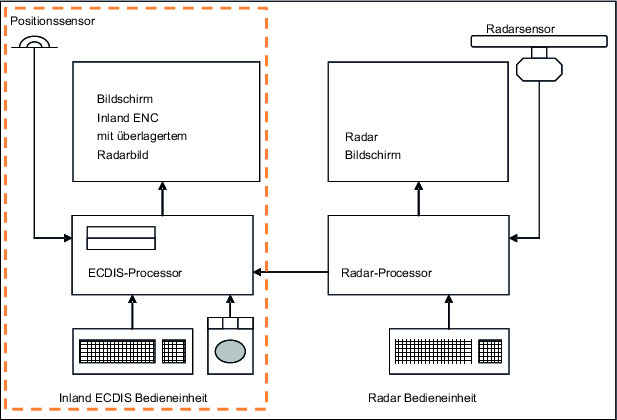
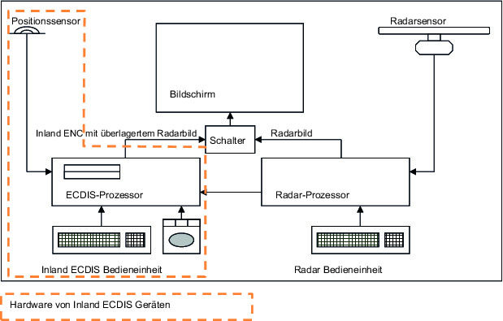

Navigationsradaranlagen und Wendeanzeiger in der Rheinschifffahrt
---
Title: (Anlage M zu Anhang II der Binnenschiffsuntersuchungsordnung)
jurabk: BinSchUO2008AnhIIAnl M
layout: default
origslug: binschuo2008anhiianl_m
slug: binschuo2008anhiianl_m

---

# (Anlage M zu Anhang II der Binnenschiffsuntersuchungsordnung) (BinSchUO2008AnhIIAnl M)

Ausfertigungsdatum
:   2012-12-20

Fundstelle
:   BGBl I: 2012, 2802, 2823

Geändert durch
:   Art. 1 Nr. 15 DBuchst. NN V v. 28.12.2012 I 2802

Änderung durch
:   Art. 1 Nr. 2 Buchst. k V v. 2.3.2017 I 330 (Nr. 10) textlich nachgewiesen, dokumentarisch noch nicht abschließend bearbeitet

## Inhalt

**Teil I**
##

Mindestanforderungen und Prüfbedingungen für Navigationsradaranlagen
in der Rheinschifffahrt

**Teil II**
##

Mindestanforderungen und Prüfbedingungen für Wendeanzeiger in der
Rheinschifffahrt

*    *   Kapitel 1

    *   Allgemeines

*    *   Kapitel 2

    *   Allgemeine Mindestanforderungen an Wendeanzeiger

*    *   Kapitel 3

    *   Mindestanforderungen an Wendeanzeiger hinsichtlich der Handhabung

*    *   Kapitel 4

    *   Technische Mindestanforderungen an Wendeanzeiger

*    *   Kapitel 5

    *   Prüfbedingungen und Prüfverfahren für Wendeanzeiger

*    *   Anhang:

    *   Fehlergrenzen für Wendeanzeiger

**Teil III**
##

Vorschriften für den Einbau und die Funktionsprüfung
von Navigationsradaranlagen und Wendeanzeigern in der Rheinschifffahrt

**Teil IV**
##

Bescheinigung über Einbau und Funktion
von Navigationsradaranlagen und Wendeanzeigern in der Rheinschifffahrt

**Teil V**
##

Verzeichnisse der zuständigen Behörden, zugelassenen Geräte und
anerkannten Fachfirmen

## Teil I - Mindestanforderungen und Prüfbedingungen für Navigationsradaranlagen in der Rheinschifffahrt

## Inhaltsverzeichnis

*    *   §§

    *

*    *   1

    *   Anwendungsbereich

*    *   2

    *   Aufgabe der Radaranlage

*    *   3

    *   Mindestanforderungen

*    *   4

    *   Typprüfung

*    *   5

    *   Antrag auf Typprüfung

*    *   6

    *   Typgenehmigung

*    *   7

    *   Kennzeichnung der Geräte, Zulassungsnummer

*    *   8

    *   Erklärung des Herstellers

*    *   9

    *   Änderungen an genehmigten Anlagen

## § 1 Anwendungsbereich

Diese Vorschriften legen die Mindestanforderungen an
Navigationsradaranlagen in der Rheinschifffahrt fest sowie die
Bedingungen, unter denen die Erfüllung der Mindestanforderungen
geprüft wird. Inland-ECDIS-Geräte, die im Navigationsmodus betrieben
werden können, sind Navigationsradaranlagen im Sinne dieser
Vorschriften.

## § 2 Aufgabe der Radaranlage

Radaranlagen müssen ein für die Führung des Schiffes verwertbares Bild
über seine Position in Bezug auf die Betonnung, die Uferkonturen und
die für die Schifffahrt wesentlichen Bauwerke geben sowie andere
Schiffe und über die Wasseroberfläche hinausragende Hindernisse im
Fahrwasser sicher und rechtzeitig erkennen lassen.

## § 3 Mindestanforderungen

1.  Radaranlagen müssen den Anforderungen des Gesetzes über Funkanlagen
    und Telekommunikationsendeinrichtungen vom 7. Februar 2001 (BGBl. I S.
    170), das zuletzt durch Artikel 1 des Gesetzes vom 3. Mai 2012 (BGBl.
    I S. 1717) geändert worden ist, entsprechen.

2.  Darüber hinaus müssen die Radaranlagen den Anforderungen der
    Europäischen Norm DIN EN 302194-1:2007 genügen.

3.  Nummer 2 gilt nicht für die Hardware von Inland-ECDIS-Geräten, die im
    Navigationsmodus in der Systemkonfiguration 2 oder 3 nach dem Standard
    Inland-ECDIS-Edition 2.3 Abschnitt 1 Punkt 5.2 in Verbindung mit
    Abschnitt 4 Punkt 2.2.2 oder 2.2.3 betrieben werden, wenn eine
    Konformitätsbescheinigung des Herstellers vorgelegt wird. Diese
    Konformitätsbescheinigung muss bestätigen, dass die Hardware

    a)  so konstruiert und gefertigt ist, dass sie den typischen Belastungen
        und Umgebungsbedingungen, wie sie auf einem Schiff vorherrschen, ohne
        Einbußen von Qualität und Zuverlässigkeit widersteht und

    b)  andere Kommunikations- und Navigationsgeräte an Bord in deren Betrieb
        nicht stört.

    Ausgenommen von Satz 1 sind Bildschirmgeräte, die im Navigationsmodus
    in der Systemkonfiguration 3 betrieben werden, sowie
    Hardwarekomponenten, die der Bereitstellung der Radarinformationen vom
    Radar-Prozessor für die Darstellung auf dem Bildschirm des Inland-
    ECDIS-Gerätes dienen.

## § 4 Typprüfung

Radaranlagen sind zum Einbau an Bord von Schiffen nur dann zugelassen,
wenn anhand einer Typprüfung nachgewiesen wurde, dass sie die
Mindestanforderungen des § 3 Nummer 2 erfüllen. Prüfungen zum Nachweis
der Erfüllung der Mindestanforderungen des § 3 Nummer 1 sind nicht
Bestandteil der Typprüfung.

## § 5 Antrag auf Typprüfung

1.  Der Antrag auf Typprüfung einer Radaranlage ist bei einer zuständigen
    Prüfbehörde eines Rheinuferstaates oder Belgiens zu stellen.

2.  Mit dem Antrag sind folgende Unterlagen einzureichen:

    a)  zwei ausführliche technische Beschreibungen,

    b)  zwei komplette Sätze der Schaltungs- und Service-Unterlagen,

    c)  zwei ausführliche Bedienungsanleitungen,

    d)  zwei Kurzbedienungsanleitungen und

    e)  gegebenenfalls Nachweise über bereits durchgeführte Prüfungen.

3.  Im Rahmen der Typprüfung ist Antragsteller eine juristische oder
    natürliche Person, unter deren Namen, Handelsmarke oder sonstiger
    charakteristischer Bezeichnung die zur Typprüfung angemeldete Anlage
    hergestellt oder gewerblich vertrieben wird.

## § 6 Typgenehmigung

Nach einer erfolgreichen Typprüfung wird die Typgenehmigung durch die
Prüfbehörde durch das Ausstellen einer Bescheinigung über die
Typgenehmigung erteilt. Bei Nichterfüllung der Mindestanforderungen
werden dem Antragsteller die Ablehnungsgründe schriftlich mitgeteilt.
Die zuständige Behörde teilt die von ihr zugelassenen Geräte der
Zentralkommission für die Rheinschifffahrt mit.

## § 7 Kennzeichnung der Geräte, Zulassungsnummer

1.  Die einzelnen Geräte der Anlage sind auf dauerhafte Art und Weise mit
    dem Namen des Herstellers, der Bezeichnung der Anlage, dem Typ des
    Gerätes und der Seriennummer zu versehen.

2.  Die von der zuständigen Behörde erteilte Genehmigungsnummer ist
    dauerhaft am Sichtgerät der Anlage anzubringen, sodass sie auch nach
    dem Einbau deutlich sichtbar ist. Die Zulassungsnummer setzt sich wie
    folgt zusammen: R-N-NNN

    *        *   (R

        *   =

        *   Rhein

    *        *   N

        *   =

        *   Nummer des Landes der Zulassung,

    *        *
        *
        *   wobei 1 = D, 2 = F, 4 = N, 6 = B, 14 = CH

    *        *   NNN

        *   =

        *   dreistellige Nummer, die von der zuständigen Behörde festzulegen ist.)

3.  Die Genehmigungsnummer darf nur im Zusammenhang mit der zugehörigen
    Genehmigung verwendet werden. Für die Anfertigung und das Anbringen
    der Genehmigungsnummer hat der Antragsteller zu sorgen.

4.  Die zuständige Behörde teilt der Zentralkommission für die
    Rheinschifffahrt die erteilte Genehmigungsnummer sowie die Bezeichnung
    des Typs, den Namen des Hersteller, den Namen des Inhabers der
    Typgenehmigung und den Tag der Zulassung umgehend mit.

## § 8 Erklärung des Herstellers

Zu jeder Anlage muss eine Erklärung des Herstellers mitgeliefert
werden, in der zugesichert ist, dass die Anlage die bestehenden
Mindestanforderungen erfüllt und ohne Einschränkungen dem bei der
Prüfung vorgestellten Typ baugleich ist.

## § 9 Änderungen an genehmigten Anlagen

1.  Änderungen an genehmigten Anlagen führen zum Erlöschen der
    Genehmigung. Soweit Änderungen beabsichtigt sind, sind diese der
    Prüfbehörde schriftlich mitzuteilen.

2.  Die Prüfbehörde entscheidet, ob die Genehmigung weiterhin bestehen
    bleibt oder ob eine Nachprüfung oder eine erneute Typprüfung notwendig
    ist. Im Falle einer erneuten Typprüfung wird eine neue
    Genehmigungsnummer erteilt.

## Anhang Bild 1 und 2

Bild 1: Inland ECDIS Gerät,
## **autarkes Gerät mit Verbindung zur Radaranlage
(Systemkonfiguration 2)**

Bild 2: Inland ECDIS Gerät,
autarkes Gerät mit Verbindung zur Radaranlage
## **und gemeinsamem Monitor (Systemkonfiguration 3)**

## Teil II - Mindestanforderungen und Prüfbedingungen für Wendeanzeiger in der Rheinschifffahrt

## Inhaltsverzeichnis

**Kapitel 1**
**Allgemeines**
##

*    *   §§

    *

*    *   1.01

    *   Anwendungsbereich

*    *   1.02

    *   Aufgabe des Wendeanzeigers

*    *   1.03

    *   Typprüfung

*    *   1.04

    *   Antrag auf Typprüfung

*    *   1.05

    *   Typgenehmigung

*    *   1.06

    *   Kennzeichnung der Geräte, Genehmigungsnummer

*    *   1.07

    *   Erklärung des Herstellers

*    *   1.08

    *   Änderungen an genehmigten Anlagen

**Kapitel 2**
**Allgemeine Mindestanforderungen an Wendeanzeiger**
##

*    *   2.01

    *   Konstruktion, Ausführung

*    *   2.02

    *   Abgestrahlte Funkstörungen und elektromagnetische Verträglichkeit

*    *   2.03

    *   Bedienung

*    *   2.04

    *   Bedienungsanleitungen

*    *   2.05

    *   Einbau und Funktionsprüfung

**Kapitel 3**
**Mindestanforderungen an Wendeanzeiger hinsichtlich der Handhabung**
##

*    *   3.01

    *   Zugriff auf den Wendeanzeiger

*    *   3.02

    *   Anzeige der Wendegeschwindigkeit

*    *   3.03

    *   Messbereiche

*    *   3.04

    *   Genauigkeit der angezeigten Wendegeschwindigkeit

*    *   3.05

    *   Empfindlichkeit

*    *   3.06

    *   Funktionsüberwachung

*    *   3.07

    *   Unempfindlichkeit gegen andere typische Schiffsbewegungen

*    *   3.08

    *   Unempfindlichkeit gegen magnetische Felder

*    *   3.09

    *   Tochtergeräte

**Kapitel 4**
**Technische Mindestanforderungen an Wendeanzeiger**
##

*    *   4.01

    *   Bedienung

*    *   4.02

    *   Dämpfungseinrichtungen

*    *   4.03

    *   Anschluss von Zusatzgeräten

**Kapitel 5**
**Prüfbedingungen und Prüfverfahren für Wendeanzeiger**
##

*    *   5.01

    *   Sicherheit, Belastungsfähigkeit und Störemission

*    *   5.02

    *   Abgestrahlte Funkstörungen

*    *   5.03

    *   Prüfverfahren

*    *   Anhang: Fehlergrenzen für Wendeanzeiger

### Kapitel 1 - Allgemeines

### § 1.01 Anwendungsbereich

Diese Vorschriften legen die Mindestanforderungen an Geräte zur
Anzeige der Wendegeschwindigkeit (Wendeanzeiger) in der
Rheinschifffahrt fest sowie die Bedingungen, unter denen die Erfüllung
der Mindestanforderungen geprüft wird.

### § 1.02 Aufgabe des Wendeanzeigers

Die Wendeanzeiger haben die Aufgabe, zur Unterstützung der
Radarnavigation die Wendegeschwindigkeit des Schiffes nach Backbord
und Steuerbord zu messen und anzuzeigen.

### § 1.03 Typprüfung

Wendeanzeiger sind zum Einbau an Bord von Schiffen nur dann
zugelassen, wenn anhand einer Typprüfung nachgewiesen wurde, dass sie
die in diesen Vorschriften festgelegten Mindestanforderungen erfüllen.

### § 1.04 Antrag auf Typprüfung

1.  Der Antrag auf Typprüfung eines Wendeanzeigers ist bei einer
    zuständigen Prüfbehörde eines Rheinuferstaates oder Belgiens zu
    stellen.

2.  Mit dem Antrag sind folgende Unterlagen einzureichen:

    a)  zwei ausführliche technische Beschreibungen;

    b)  zwei komplette Sätze der Schaltungs- und Service-Unterlagen;

    c)  zwei Bedienungsanleitungen.

3.  Der Antragsteller ist verpflichtet, selbst zu prüfen oder prüfen zu
    lassen, dass die in diesen Vorschriften aufgestellten
    Mindestanforderungen erfüllt sind. Der Ergebnisbericht dieser Prüfung
    und die Messprotokolle sind dem Antrag beizufügen. Diese Unterlagen
    und die bei der Typprüfung ermittelten Daten werden bei der
    Prüfbehörde aufbewahrt.

4.  Im Rahmen der Typprüfung ist Antragsteller eine juristische oder
    natürliche Person, unter deren Namen, Handelsmarke oder sonstiger
    charakteristischer Bezeichnung die zur Typprüfung angemeldete Anlage
    hergestellt oder gewerblich vertrieben wird.

### § 1.05 Typgenehmigung

Nach einer erfolgreichen Typprüfung stellt die Prüfbehörde eine
Bescheinigung über die Typgenehmigung aus. Bei Nichterfüllung der
Mindestanforderungen werden dem Antragsteller die Ablehnungsgründe
schriftlich mitgeteilt. Die Typgenehmigung wird von der zuständigen
Behörde erteilt. Die zuständige Behörde teilt die von ihr zugelassenen
Geräte der Zentralkommission für die Rheinschifffahrt mit.

### § 1.06 Kennzeichnung der Geräte, Genehmigungsnummer

1.  Die einzelnen Geräte der Anlage sind auf dauerhafte Art und Weise mit
    dem Namen des Herstellers, der Bezeichnung der Anlage, dem Typ des
    Gerätes und der Seriennummer zu versehen.

2.  Die von der zuständigen Behörde erteilte Genehmigungsnummer ist
    dauerhaft am Bedienteil der Anlage anzubringen, sodass sie auch nach
    dem Einbau deutlich sichtbar ist. Die Zulassungsnummer setzt sich wie
    folgt zusammen: R-N-NNN

    *        *   (R

        *   =

        *   Rhein

    *        *   N

        *   =

        *   Nummer des Landes der Zulassung,

    *        *
        *
        *   wobei 1 = D, 2 = F, 4 = NL, 6 = B, 14 = CH

    *        *   NNN

        *   =

        *   dreistellige Nummer, die von der zuständigen Behörde festzulegen ist.)

3.  Die Genehmigungsnummer darf nur im Zusammenhang mit der zugehörigen
    Genehmigung verwendet werden. Für die Anfertigung und das Anbringen
    der Genehmigungsnummer hat der Antragsteller zu sorgen.

4.  Die zuständige Behörde teilt der Zentralkommission für die
    Rheinschifffahrt die erteilte Genehmigungsnummer sowie die Bezeichnung
    des Typs, den Namen des Herstellers, den Namen des Inhabers der
    Typgenehmigung und den Tag der Genehmigung umgehend mit.

### § 1.07 Erklärung des Herstellers

Zu jeder Anlage muss eine Erklärung des Herstellers mitgeliefert
werden, in der zugesichert ist, dass die Anlage die bestehenden
Mindestanforderungen erfüllt und ohne Einschränkungen dem bei der
Prüfung vorgestellten Typ baugleich ist.

### § 1.08 Änderungen an genehmigten Anlagen

1.  Änderungen an genehmigten Anlagen führen zum Erlöschen der
    Genehmigung.

    Soweit Änderungen beabsichtigt sind, sind diese der Prüfbehörde
    schriftlich mitzuteilen.

2.  Die Prüfbehörde entscheidet, ob die Genehmigung weiterhin bestehen
    bleibt oder ob eine Nachprüfung oder eine erneute Typprüfung notwendig
    ist. Im Falle einer neuen Genehmigung wird eine neue
    Genehmigungsnummer erteilt.

### Kapitel 2 - Allgemeine Mindestanforderungen an Wendeanzeiger

### § 2.01 Konstruktion, Ausführung

1.  Wendeanzeiger müssen für den Betrieb an Bord von Schiffen, die in der
    Rheinschifffahrt eingesetzt werden, geeignet sein.

2.  Konstruktion und Ausführung der Anlagen müssen in mechanischer und
    elektrischer Hinsicht dem Stand der Technik entsprechen.

3.  Soweit die Rheinschiffsuntersuchungsordnung oder diese Vorschriften
    keine abweichenden Regelungen enthalten, gelten für die Anforderungen
    an die Stromversorgung, die Sicherheit, die gegenseitige Beeinflussung
    von Bordgeräten, den Kompassschutzabstand, die klimatische
    Belastbarkeit, die mechanische Belastbarkeit, die Umweltbelastbarkeit,
    die Lärmemission und die Gerätekennzeichnung die in der Europäischen
    Norm DIN EN 60945:2003 Navigations- und Funkkommunikationsgeräte und
    -systeme für die Seeschifffahrt – Allgemeine Anforderungen –
    Prüfverfahren und geforderte Prüfergebnisse (IEC 60945:2002)
    festgelegten Anforderungen und Messmethoden. Alle Anforderungen dieser
    Vorschriften müssen bei Umgebungstemperaturen der Anlagen von 0° C bis
    40° C erfüllt werden.

### § 2.02 Abgestrahlte Funkstörungen und elektromagnetische Verträglichkeit

1.  Allgemeine Anforderungen

    Wendeanzeiger müssen den Anforderungen des Gesetzes über die
    elektromagnetische Verträglichkeit von Betriebsmitteln vom 26. Februar
    2008 (BGBl. I S. 220), das durch Artikel 1 des Gesetzes vom 20. April
    2012 (BGBl. I S. 606) geändert worden ist, umgesetzt wurde,
    entsprechen.

2.  Abgestrahlte Funkstörungen

    In den Frequenzbereichen 156 – 165 MHz, 450 – 470 MHz und 1,53 – 1,544
    GHz darf die Feldstärke den Wert von 15 μV/m nicht überschreiten.
    Diese Feldstärken gelten für eine Messdistanz von 3 Metern zum
    untersuchten Gerät.

### § 2.03 Bedienung

1.  Es sollen nicht mehr Bedieneinrichtungen vorhanden sein, als zur
    ordnungsgemäßen Bedienung erforderlich sind. Ihre Ausführung,
    Bezeichnung und Betätigung müssen eine einfache, eindeutige und
    schnelle Bedienung ermöglichen. Sie sind so anzuordnen, dass
    Bedienungsfehler nach Möglichkeit vermieden werden. Bedienorgane, die
    für den Normalbetrieb nicht notwendig sind, dürfen nicht unmittelbar
    zugänglich sein.

2.  Alle Bedieneinrichtungen und Anzeigen müssen mit Symbolen bezeichnet
    oder in englischer Sprache beschriftet sein. Sofern eine Beschriftung
    erfolgt, muss diese zusätzlich auch in deutscher Sprache angebracht
    sein. Symbole müssen den in der Europäischen Norm IEC 60417 Graphische
    Symbole für Betriebsmittel enthaltenen Bestimmungen entsprechen.
    Ziffern und Buchstaben müssen mindestens 4 mm hoch sein. Wenn aus
    technischen Gründen eine Schriftgröße von 4 mm für bestimmte
    Bezeichnungen nachweisbar nicht möglich und aus operationeller Sicht
    eine kleinere Schrift hinreichend ist, ist eine Minderung auf 3 mm
    erlaubt.

3.  Die Anlage muss so ausgeführt sein, dass Bedienungsfehler nicht zum
    Ausfall der Anlage führen.

4.  Funktionen, die über die Mindestanforderungen hinausgehen, sowie
    Anschlussmöglichkeiten für externe Geräte müssen so beschaffen sein,
    dass die Anlage unter allen Bedingungen die Mindestanforderungen
    erfüllt.

### § 2.04 Bedienungsanleitungen

Zu jeder Anlage muss eine ausführliche Bedienungsanleitung geliefert
werden. Diese muss in deutscher, englischer, französischer und
niederländischer Sprache erhältlich sein und mindestens folgende
Informationen enthalten:

a)  Inbetriebnahme und Bedienung;

b)  Wartung und Pflege;

c)  Allgemeine Sicherheitsvorschriften.

### § 2.05 Einbau und Funktionsprüfung

1.  Für den Einbau, den Austausch und die Funktionsprüfung gelten die
    Bestimmungen des Teils III.

2.  Auf dem Sensorteil des Wendeanzeigers ist die Einbaurichtung bezogen
    auf die Kiellinie anzugeben. Einbauhinweise zur Erzielung einer
    möglichst geringen Empfindlichkeit gegen andere typische
    Schiffsbewegungen sind mitzuliefern.

### Kapitel 3 - Mindestanforderungen an Wendeanzeiger hinsichtlich der Handhabung

### § 3.01 Zugriff auf den Wendeanzeiger

1.  Der Wendeanzeiger muss spätestens vier Minuten nach dem Einschalten
    betriebsbereit sein und innerhalb der geforderten Genauigkeitsgrenzen
    arbeiten.

2.  Die Einschaltung ist optisch anzuzeigen. Die Beobachtung und die
    Bedienung des Wendeanzeigers müssen gleichzeitig möglich sein.

3.  Drahtlose Fernbedienungen sind nicht erlaubt.

### § 3.02 Anzeige der Wendegeschwindigkeit

1.  Die Anzeige der Wendegeschwindigkeit muss auf einer linear geteilten
    Skala mit dem Nullpunkt in der Mitte erfolgen. Die
    Wendegeschwindigkeit muss nach Richtung und Größe mit der nach § 3.04
    vorgeschriebenen Genauigkeit abgelesen werden können. Zeiger- und
    Balkendarstellungen sind erlaubt.

2.  Die Anzeigeskala muss mindestens 20 cm lang sein und kann entweder
    kreisförmig oder gestreckt ausgeführt sein. Gestreckte Skalen dürfen
    nur horizontal angeordnet sein.

3.  Ausschließlich numerische Anzeigen sind nicht erlaubt.

### § 3.03 Messbereiche

Wendeanzeiger können mit nur einem oder mit mehreren Messbereichen
ausgestattet sein. Folgende Messbereiche werden empfohlen:
30°/min,
60°/min,
90°/min,
180°/min,
300°/min.

### § 3.04 Genauigkeit der angezeigten Wendegeschwindigkeit

Der angezeigte Wert darf nicht mehr als 2 % des Bereichsendwertes oder
nicht mehr als 10 % vom wahren Wert abweichen. Der jeweils größere
Wert ist zulässig (siehe Anhang zu diesem Teil II).

### § 3.05 Empfindlichkeit

Die Ansprechschwelle darf eine Winkelgeschwindigkeitsänderung von 1 %
des eingestellten Bereiches nicht überschreiten.

### § 3.06 Funktionsüberwachung

1.  Wenn der Wendeanzeiger nicht innerhalb der geforderten
    Genauigkeitsgrenzen arbeitet, muss dies angezeigt werden.

2.  Wenn ein Kreisel benutzt wird, muss die kritische Änderung der
    Kreiseldrehzahl mit einer Anzeige signalisiert werden. Kritisch ist
    eine Änderung der Kreiseldrehzahl, die 10 % Rückgang der Genauigkeit
    bewirkt.

### § 3.07 Unempfindlichkeit gegen andere typische Schiffsbewegungen

1.  Rollbewegungen mit Neigungswinkeln bis zu 10° bei
    Winkelgeschwindigkeiten bis zu 4°/s dürfen keine über die
    Toleranzgrenzen hinausgehenden Messfehler verursachen.

2.  Stoßförmige Belastungen, wie sie zum Beispiel beim Anlegen auftreten
    können, dürfen keine bleibenden, über die Toleranzgrenzen
    hinausgehenden, Anzeigefehler verursachen.

### § 3.08 Unempfindlichkeit gegen magnetische Felder

Der Wendeanzeiger muss unempfindlich sein gegen Magnetfelder, die
üblicherweise an Bord von Schiffen auftreten können.

### § 3.09 Tochtergeräte

Tochtergeräte müssen alle Anforderungen erfüllen, die an Wendeanzeiger
gestellt werden.

### Kapitel 4 - Technische Mindestanforderungen an Wendeanzeiger

### § 4.01 Bedienung

1.  Alle Bedienorgane müssen so angebracht sein, dass während ihrer
    Betätigung keine korrespondierende Anzeige abgedeckt wird und die
    Radarnavigation ohne Einschränkung möglich bleibt.

2.  Alle Bedienorgane und Anzeigen müssen mit einer blendungsfreien, für
    alle Lichtverhältnisse geeigneten Beleuchtung ausgerüstet sein, die
    mit einem unabhängigen Einsteller bis auf Null eingestellt werden
    kann.

3.  Der Betätigungssinn von Bedienorganen muss so sein, dass Betätigungen
    nach rechts oder nach oben eine positive und Betätigungen nach links
    oder nach unten eine negative Auswirkung auf die Stellgröße haben.

4.  Wenn Drucktasten benützt werden, müssen diese so gestaltet sein, dass
    sie auch durch Ertasten gefunden und betätigt werden können. Außerdem
    müssen sie einen deutlich spürbaren Druckpunkt haben.

### § 4.02 Dämpfungseinrichtungen

1.  Das Sensorsystem soll kritisch bedämpft sein. Die
    Dämpfungszeitkonstante von 63 % des Endwertes darf 0,4 s nicht
    überschreiten.

2.  Die Anzeige muss kritisch bedämpft sein. Es darf ein Bedienorgan zur
    zusätzlichen Vergrößerung der Anzeigebedämpfung vorhanden sein.
    Keinesfalls darf die Dämpfungszeitkonstante 5 s überschreiten.

### § 4.03 Anschluss von Zusatzgeräten

1.  Wenn der Wendeanzeiger eine Möglichkeit zum Anschluss von
    Tochteranzeigen oder ähnlichem besitzt, muss das
    Wendegeschwindigkeitssignal als elektrisches Signal zur Verfügung
    stehen. Das Signal muss galvanisch von Masse getrennt und als
    proportionale Analogspannung mit 20 mV/°/min ± 5 % und einem
    Innenwiderstand von maximal 100*                    verfügbar sein.
    Die Polarität muss positiv für Steuerborddrehung und negativ für
    Backborddrehung des Schiffes sein. Die Ansprechschwelle darf einen
    Wert von 0,3°/min nicht überschreiten. Der Nullpunktfehler darf im
    Temperaturbereich von 0° C bis 40° C einen Wert von 1°/min nicht
    überschreiten. Bei eingeschaltetem Wendeanzeiger und bewegungsloser
    Aufstellung des Sensors darf die Störspannung im Ausgangssignal,
    gemessen hinter einem Tiefpassfilter erster Ordnung mit 10 Hz
    Bandbreite, 10 mV nicht überschreiten. Das Wendegeschwindigkeitssignal
    muss mit einer nicht über die Grenzen nach § 4.02 Nummer 1
    hinausgehenden Bedämpfung verfügbar sein.

2.  Zum Schalten eines externen Alarms muss ein Schaltkontakt vorhanden
    sein. Dieser Schaltkontakt muss galvanisch vom Wendeanzeiger getrennt
    sein. Der externe Alarm muss durch Schließen des Schaltkontaktes
    jeweils aktiviert werden, wenn

    a)  der Wendeanzeiger ausgeschaltet ist,

    b)  der Wendeanzeiger nicht betriebsbereit ist oder

    c)  die Funktionsüberwachung wegen eines unzulässig hohen Fehlers (§ 3.06)
        angesprochen hat.

### Kapitel 5 - Prüfbedingungen und Prüfverfahren für Wendeanzeiger

### § 5.01 Sicherheit, Belastungsfähigkeit und Störemission

Die Prüfung der Stromversorgung, der Sicherheit, der gegenseitigen
Beeinflussung von Bordgeräten, des Kompassschutzabstandes, der
klimatischen Belastbarkeit, der mechanischen Belastbarkeit, der
Umweltbelastbarkeit und der Lärmemission erfolgt entsprechend der
Europäischen Norm DIN EN 60945:2003.

### § 5.02 Abgestrahlte Funkstörungen

Die Messungen der abgestrahlten Funkstörungen werden entsprechend der
Europäischen Norm DIN EN 60945:2003, im Frequenzbereich von 30 MHz bis
2 000 MHz durchgeführt. Die Anforderungen nach § 2.02 Nummer 2 müssen
erfüllt sein.

### § 5.03 Prüfverfahren

1.  Der Wendeanzeiger wird unter Nennbedingungen und unter
    Extrembedingungen betrieben und geprüft. Dabei werden die
    Betriebsspannung und die Umgebungstemperatur bis zu den
    vorgeschriebenen Grenzen verändert. Außerdem werden Funksender zur
    Erzeugung der Grenzfeldstärken in der Umgebung des Wendeanzeigers
    betrieben.

2.  Unter den Bedingungen nach vorstehender Nummer 1 muss der
    Anzeigefehler innerhalb der in dem Anhang zu diesem Teil II
    dargestellten Toleranzgrenzen liegen. Alle anderen Anforderungen
    müssen erfüllt sein.

### Anhang Fehlergrenzen für Wendeanzeiger

## Teil III - Vorschriften für den Einbau und die Funktionsprüfung von Navigationsradaranlagen und Wendeanzeigern in der Rheinschifffahrt

## Inhaltsverzeichnis

*    *   §§

    *

*    *   1

    *   Ziel dieser Vorschriften

*    *   2

    *   Zulassung der Geräte

*    *   3

    *   Anerkannte Fachfirmen

*    *   4

    *   Anforderungen an die Bordstromversorgung

*    *   5

    *   Einbau der Radarantenne

*    *   6

    *   Einbau des Radarsichtgerätes und des Bedienteils

*    *   7

    *   Einbau des Wendeanzeigers

*    *   8

    *   Einbau des Positionssensors

*    *   9

    *   Einbau- und Funktionsprüfung

*    *   10

    *   Bescheinigung über Einbau und Funktion

## § 1 Ziel dieser Vorschriften

Mit diesen Vorschriften soll sichergestellt werden, dass im Interesse
der Sicherheit und Leichtigkeit der Binnenschifffahrt
Navigationsradar- und Wendeanzeigeranlagen nach optimalen technischen
und ergonomischen Gesichtspunkten eingebaut werden und anschließend
eine Funktionsprüfung erfolgt. Inland-ECDIS-Geräte, die im
Navigationsmodus betrieben werden können, sind Navigationsradaranlagen
im Sinne dieser Vorschriften.

## § 2 Zulassung der Geräte

Für die Radarfahrt in der Rheinschifffahrt dürfen nur Geräte eingebaut
werden, die eine Zulassung nach den geltenden Vorschriften der
Zentralkommission für die Rheinschifffahrt besitzen und die eine
Zulassungsnummer tragen oder auf Grund gleichwertiger Typgenehmigungen
zugelassene Geräte.

## § 3 Anerkannte Fachfirmen

1.  Der Einbau oder Austausch sowie die Reparatur oder Wartung von
    Radaranlagen und Wendeanzeigern dürfen nur von geeigneten Fachfirmen,
    die von der zuständigen Behörde auf der Grundlage von § 1 anerkannt
    sind, erfolgen. Die zuständigen Behörden sind der Zentralkommission
    für die Rheinschifffahrt bekannt zu geben.

2.  Die Anerkennung kann von der zuständigen Behörde widerrufen werden,
    wenn die Fachfirma den Anforderungen nach § 1 nicht mehr gerecht wird.

3.  Die zuständige Behörde teilt die Namen, Adressen, Telefonnummern und
    Emailadressen der von ihr anerkannten Fachfirmen der Zentralkommission
    für die Rheinschifffahrt umgehend mit.

## § 4 Anforderungen an die Bordstromversorgung

Die Stromzuführungen für Radaranlagen und Wendeanzeiger müssen jeweils
eine eigene Absicherung haben und möglichst ausfallsicher sein.

## § 5 Einbau der Radarantenne

1.  Die Radarantenne soll so nahe wie möglich über der Mittellängsachse
    des Schiffes eingebaut werden. Im Strahlungsbereich der Antenne soll
    sich kein Hindernis befinden, das Fehlechos oder unerwünschte
    Abschattungen verursachen kann; gegebenenfalls muss die Antenne auf
    dem Vorschiff installiert werden. Die Aufstellung und die Befestigung
    der Radarantenne in der Betriebsposition müssen so stabil sein, dass
    die Radaranlage mit der geforderten Genauigkeit arbeiten kann.

2.  Nachdem der Einbauwinkelfehler korrigiert worden ist, darf nach dem
    Einstellen des Radarbildes die Abweichung zwischen Vorauslinie und
    Schiffslängsachse nicht größer als 1° sein.

## § 6 Einbau des Radarsichtgerätes und des Bedienteils

1.  Radarsichtgerät und Bedienteil müssen im Steuerhaus so eingebaut
    werden, dass die Auswertung des Radarbildes und die Bedienung der
    Radaranlage mühelos möglich sind. Die azimutale Anordnung des
    Radarbildes muss mit der natürlichen Lage der Umgebung übereinstimmen.
    Halterungen und verstellbare Konsolen sind so zu konstruieren, dass
    sie in jeder Lage ohne Eigenschwingung arretiert werden können.

2.  Während der Radarfahrt darf künstliches Licht keine Reflexionen in
    Richtung des Radarbeobachters hervorrufen.

3.  Wenn die Bedienteile nicht im Sichtgerät eingebaut sind, müssen sie
    sich in einem Gehäuse befinden, das nicht mehr als 1 m vom Bildschirm
    entfernt angeordnet sein darf. Drahtlose Fernbedienungen sind nicht
    erlaubt.

4.  Soweit Tochtergeräte eingebaut werden, unterliegen sie den
    Vorschriften, die für Navigationsradaranlagen gelten.

## § 7 Einbau des Wendeanzeigers

1.  Das Sensorteil ist möglichst mittschiffs, horizontal und auf die
    Längsachse des Schiffes ausgerichtet einzubauen. Der Einbauort soll
    möglichst schwingungsfrei sein und geringen Temperaturschwankungen
    unterliegen. Das Anzeigegerät ist möglichst über dem Radarsichtgerät
    einzubauen.

2.  Soweit Tochtergeräte eingebaut werden, unterliegen sie den
    Vorschriften, die für Wendeanzeiger gelten.

## § 8 Einbau des Positionssensors

Der Positionssensor, insbesondere eine DGPS-Antenne, muss so eingebaut
werden, dass er die bestmögliche Genauigkeit erzielt und durch
Aufbauten und Sendeanlagen an Bord möglichst wenig beeinträchtigt
wird.

## § 9 Einbau- und Funktionsprüfung

1.  Vor der ersten Inbetriebnahme nach dem Einbau, bei Erneuerungen oder
    Verlängerungen des Schiffsattestes, ausgenommen nach Anhang II § 2.09
    Nummer 2, sowie nach jedem Umbau am Schiff, der die
    Betriebsverhältnisse dieser Anlagen beeinträchtigen könnte, muss von
    der zuständigen Behörde oder von einer nach § 3 anerkannten Fachfirma
    eine Einbau- und Funktionsprüfung durchgeführt werden.

2.  Dabei müssen die folgenden Bedingungen erfüllt sein:

    a)  die Stromversorgung ist mit einer eigenen Absicherung versehen;

    b)  die Betriebsspannung liegt innerhalb der Toleranz;

    c)  die Kabel und deren Verlegung entsprechen den Vorschriften der
        Rheinschiffsuntersuchungsordnung und gegebenenfalls des ADN;

    d)  die Antennendrehzahl beträgt mindestens 24 U/min;

    e)  im Strahlungsbereich der Antenne ist an Bord kein Hindernis vorhanden,
        das die Navigation beeinträchtigt;

    f)  der Sicherheitsschalter für die Antenne, sofern vorhanden, ist
        betriebsbereit;

    g)  Sichtgeräte, Wendeanzeiger und Bedienteile sind ergonomisch günstig
        angeordnet;

    h)  die Vorauslinie der Radaranlage weicht höchstens 1° von der
        Schiffslängsachse ab;

    i)  die Entfernungs- und Azimutdarstellungsgenauigkeit erfüllen die
        Anforderungen (Messung anhand von bekannten Zielen);

    k)  die Linearität im Nahbereich (Pushing und Pulling) ist in Ordnung;

    l)  die darstellbare Mindestentfernung beträgt*
        15 m;

    m)  der Bildmittelpunkt ist sichtbar und nicht größer im Durchmesser als 1
        mm;

    n)  Fehlechos durch Reflexionen und unerwünschte Abschattungen im
        Vorausbereich sind nicht vorhanden oder beeinträchtigen die sichere
        Fahrt nicht;

    o)  Seegangecho- und Regenechounterdrückung (STC- und FTC-Preset) und ihre
        Einstellmöglichkeiten sind in Ordnung;

    p)  die Einstellbarkeit der Verstärkung ist in Ordnung;

    q)  Bildschärfe und Auflösung sind in Ordnung;

    r)  die Wenderichtung des Schiffes entspricht der Anzeige auf dem
        Wendeanzeiger und die Nullstellung bei Geradeausfahrt ist in Ordnung;

    s)  eine Empfindlichkeit der Radaranlage gegen Aussendungen der
        Bordfunkanlage oder Störungen von anderen Verursachern an Bord liegt
        nicht vor;

    t)  eine Beeinträchtigung anderer Bordgeräte durch die Radaranlage
        und/oder den Wendeanzeiger ist nicht gegeben.

3.  Für Inland-ECDIS-Geräte müssen zudem die folgenden Bedingungen erfüllt
    sein:

    a)  der statische Positionsfehler der Karte darf 2 m nicht überschreiten;

    b)  der statische Winkelfehler der Karte darf 1° nicht überschreiten.

## § 10 Bescheinigung über Einbau und Funktion

Nach erfolgreicher Prüfung nach § 9 stellt die zuständige Behörde oder
die anerkannte Fachfirma eine Bescheinigung nach dem Muster des Teils
IV dieser Anlage aus. Diese Bescheinigung ist ständig an Bord
mitzuführen. Bei Nichterfüllung der Prüfbedingungen wird eine
Mängelliste ausgestellt. Eine eventuell noch vorhandene Bescheinigung
wird eingezogen oder durch die anerkannte Fachfirma der zuständigen
Behörde übersandt.

## Teil IV - (Muster) Bescheinigung über Einbau und Funktion von Navigationsradaranlagen und Wendeanzeigern in der Rheinschifffahrt

*    *
    *   Art/Name des Schiffes: ..........

    *

*    *
    *   Einheitliche europäische Schiffsnummer: ..........

    *

*    *
    *
    *
    *
    *
    *
    *

*    *
    *   **Schiffseigner**

    *

*    *
    *   Name: ..........

    *

*    *
    *   Anschrift: ..........

    *

*    *
    *   Telefon: ..........

    *

*    *
    *
    *
    *
    *
    *

*    *
    *   **Radargeräte**

    *
    *
    *   Anzahl: ..........

    *

*    *
    *   lfd. Nr.

    *   Typ

    *   Hersteller

    *   Zulassungsnummer

    *   Seriennummer

    *

*    *
    *
    *
    *
    *
    *
    *

*    *
    *
    *
    *
    *
    *
    *

*    *
    *
    *
    *
    *
    *
    *

*    *
    *   **Wendeanzeiger**

    *
    *
    *   Anzahl: ..........

    *

*    *
    *   lfd. Nr.

    *   Typ

    *   Hersteller

    *   Zulassungsnummer

    *   Seriennummer

    *

*    *
    *
    *
    *
    *
    *
    *

*    *
    *
    *
    *
    *
    *
    *

*    *
    *
    *
    *
    *
    *
    *

*    *
    *   Hiermit wird bescheinigt, dass Radaranlagen und Wendeanzeiger dieses
        Schiffes den Vorschriften der Anlage M Teil III des Anhangs II der
        Binnenschiffsuntersuchungsordnung, für den Einbau und die
        Funktionsprüfung von Navigationsradaranlagen und Wendeanzeigern in der
        Rheinschifffahrt entsprechen.

    *

*    *
    *
    *
    *
    *
    *
    *

*    *
    *   **Anerkannte Fachfirma**

    *

*    *
    *   Name: ..........

    *

*    *
    *   Anschrift: ..........

    *

*    *
    *   Telefon: ..........

    *

*    *
    *
    *   Stempel

    *
    *   Ort ..........

    *   Datum ..........

    *

*    *
    *
    *
    *
    *   Unterschrift ..........

    *
    *

*    *
    *
    *
    *
    *
    *
    *

*    *
    *   **Anerkennungsbehörde**

    *

*    *
    *   Name: ..........

    *

*    *
    *   Anschrift: ..........

    *

*    *
    *   Telefon: ..........

    *

## Teil V - (Muster)

**1.** **Verzeichnis der nach Anhang II Anlage M der
    Binnenschiffsuntersuchungsordnung für die Zulassung von
    Navigationsradaranlagen und Wendeanzeigern zuständigen Behörden**

    *        *   Land

        *   Name

        *   Adresse

        *   Telefonnummer

        *   E-Mailadresse

    *        *   Belgien

        *
        *
        *
        *

    *        *   Deutschland

        *
        *
        *
        *

    *        *   Frankreich

        *
        *
        *
        *

    *        *   Niederlande

        *
        *
        *
        *

    *        *   Schweiz

        *
        *
        *
        *

   Ist keine Behörde angegeben, wurde seitens des betreffenden Staates
    keine zuständige Behörde benannt.

**2.** **Verzeichnis der nach Anhang II Anlage M der
    Binnenschiffsuntersuchungsordnung zugelassenen Navigationsradaranlagen
    und Wendeanzeiger**

    *        *   lfd. Nr.

        *   Typ

        *   Hersteller

        *   Inhaber der Typgenehmigung

        *   Tag der
            Zulassung

        *   zuständige Behörde

        *   Zulassungs-Nr.

    *        *
        *
        *
        *
        *
        *
        *

**3.** **Verzeichnis der nach Anhang II Anlage M der
    Binnenschiffsuntersuchungsordnung auf Grund gleichwertiger
    Typgenehmigungen zugelassenen Navigationsradaranlagen und
    Wendeanzeigern**

    *        *   lfd. Nr.

        *   Typ

        *   Hersteller

        *   Inhaber der Typgenehmigung

        *   Tag der
            Zulassung

        *   zuständige Behörde

        *   Zulassungs-Nr.

    *        *
        *
        *
        *
        *
        *
        *

**4.** **Verzeichnis der nach Anhang II Anlage M der
    Binnenschiffsuntersuchungsordnung für den Einbau oder Austausch von
    Navigationsradaranlagen und Wendeanzeigern anerkannten Fachfirmen**

    **Belgien**

    *        *   lfd. Nr.

        *   Name

        *   Adresse

        *   Telefonnummer

        *   E-Mailadresse

    *        *
        *
        *
        *
        *

   Ist keine Fachfirma angegeben, wurde für Firmen in diesem Land keine
    Anerkennung ausgesprochen.

    **Deutschland**

    *        *   lfd. Nr.

        *   Name

        *   Adresse

        *   Telefonnummer

        *   E-Mailadresse

    *        *
        *
        *
        *
        *

   Ist keine Fachfirma angegeben, wurde für Firmen in diesem Land keine
    Anerkennung ausgesprochen.

    **Frankreich**

    *        *   lfd. Nr.

        *   Name

        *   Adresse

        *   Telefonnummer

        *   E-Mailadresse

    *        *
        *
        *
        *
        *

   Ist keine Fachfirma angegeben, wurde für Firmen in diesem Land keine
    Anerkennung ausgesprochen.

    **Niederlande**

    *        *   lfd. Nr.

        *   Name

        *   Adresse

        *   Telefonnummer

        *   E-Mailadresse

    *        *
        *
        *
        *
        *

   Ist keine Fachfirma angegeben, wurde für Firmen in diesem Land keine
    Anerkennung ausgesprochen.

    **Schweiz**

    *        *   lfd. Nr.

        *   Name

        *   Adresse

        *   Telefonnummer

        *   E-Mailadresse

    *        *
        *
        *
        *
        *

   Ist keine Fachfirma angegeben, wurde für Firmen in diesem Land keine
    Anerkennung ausgesprochen.

