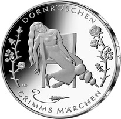
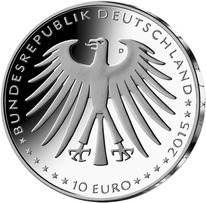
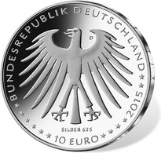

# Bekanntmachung über die Ausprägung von deutschen Euro-Gedenkmünzen im Nennwert von 10 Euro (Gedenkmünze „Dornröschen“) (Münz10EuroBek 2015-06-23/2)

Ausfertigungsdatum
:   2015-06-23

Fundstelle
:   BGBl I: 2015, 1036

## (XXXX)

Gemäß den §§ 2, 4 und 5 des Münzgesetzes vom 16. Dezember 1999 (BGBl.
I S. 2402) hat die Bundesregierung beschlossen, zum Thema
„Dornröschen“ eine deutsche Euro-Gedenkmünze im Nennwert von 10 Euro
prägen zu lassen. Diese Münze ist die vierte von insgesamt sechs
Ausgaben im Rahmen der in 2012 begonnenen Serie „200 Jahre Grimms
Märchen“. Am 20. Dezember 1812 erschien der erste Band der Kinder- und
Hausmärchen der Gebrüder Grimm.

Die Auflage der Münze beträgt ca. 1,3 Mio. Stück, davon ca. 0,2 Mio.
Stück in Spiegelglanzqualität. Die Prägung erfolgt durch das
Bayerische Hauptmünzamt, München (Prägezeichen D).

Die Münze wird ab dem 12. Februar 2015 in den Verkehr gebracht. Die 10
-Euro-Gedenkmünze in der Stempelglanzqualität besteht aus einer
Kupfer-Nickel-Legierung (CuNi25), hat einen Durchmesser von 32,5
Millimetern und eine Masse von 14 Gramm. Die Spiegelglanzmünze besteht
aus einer Legierung von 625 Tausendteilen Silber und 375 Tausendteilen
Kupfer, hat einen Durchmesser von 32,5 Millimetern und ein Gewicht von
16 Gramm. Das Gepräge auf beiden Seiten ist erhaben und wird von einem
schützenden, glatten Randstab umgeben.

Die Bildseite stellt eine der typischen Szenen aus „Dornröschen“ dar.
Die im Zentrum schlafend dargestellte weibliche Figur wird von einem
pflanzlichen Ornament gerahmt, getragen von Sensibilität und
Natürlichkeit.

Die Wertseite zeigt einen Adler, den Schriftzug „BUNDESREPUBLIK
DEUTSCHLAND“, Wertziffer und Wertbezeichnung, das Prägezeichen „D“ des
Bayerischen Hauptmünzamtes, München, die Jahreszahl 2015 sowie die
zwölf Europasterne. Auf der Wertseite der Münze in
Spiegelglanzqualität ist zusätzlich die Angabe „SILBER 625“
aufgeprägt.

Der glatte Münzrand enthält in vertiefter Prägung die Inschrift:

„EIN HUNDERTJÄHRIGER TIEFER SCHLAF“.

Der Entwurf stammt von der Künstlerin Marianne Dietz aus Berlin.

## Schlussformel

Der Bundesminister der Finanzen

## (XXXX)

(Fundstelle: BGBl. I 2015, 1036)

*    *        
    *        

*    *        
    *        

