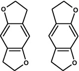
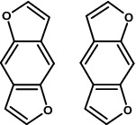
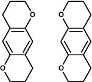
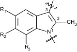
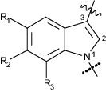
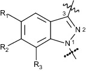
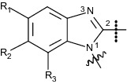

# Neue-psychoaktive-Stoffe-Gesetz (NpSG)

Ausfertigungsdatum
:   2016-11-21

Fundstelle
:   BGBl I: 2016, 2615

Zuletzt geändert durch
:   Art. 6 Abs. 8 G v. 13.4.2017 I 872

## § 1 Anwendungsbereich

(1) Dieses Gesetz ist anzuwenden auf neue psychoaktive Stoffe im Sinne
des § 2 Nummer 1.

(2) Dieses Gesetz ist nicht anzuwenden auf

1.  Betäubungsmittel im Sinne des § 1 Absatz 1 des
    Betäubungsmittelgesetzes und

2.  Arzneimittel im Sinne des § 2 Absatz 1, 2, 3a und 4 Satz 1 des
    Arzneimittelgesetzes.

## § 2 Begriffsbestimmungen

Im Sinne dieses Gesetzes ist

1.  neuer psychoaktiver Stoff ein Stoff oder eine Zubereitung eines
    Stoffes aus einer der in der Anlage genannten Stoffgruppen;

2.  Zubereitung ohne Rücksicht auf den Aggregatzustand ein Stoffgemisch
    oder die Lösung eines Stoffes oder mehrerer Stoffe außer den natürlich
    vorkommenden Gemischen und Lösungen;

3.  Herstellen das Gewinnen, das Anfertigen, das Zubereiten, das Be- oder
    Verarbeiten, das Reinigen, das Umwandeln, das Abpacken und das
    Umfüllen einschließlich Abfüllen;

4.  Inverkehrbringen das Vorrätighalten zum Verkauf oder zu sonstiger
    Abgabe sowie das Feilhalten, das Feilbieten, die Abgabe und das
    Überlassen zum unmittelbaren Verbrauch an andere.

## § 3 Unerlaubter Umgang mit neuen psychoaktiven Stoffen

(1) Es ist verboten, mit einem neuen psychoaktiven Stoff Handel zu
treiben, ihn in den Verkehr zu bringen, ihn herzustellen, ihn in den,
aus dem oder durch den Geltungsbereich dieses Gesetzes zu verbringen,
ihn zu erwerben, ihn zu besitzen oder ihn einem anderen zu
verabreichen.

(2) Vom Verbot ausgenommen sind

1.  nach dem jeweiligen Stand von Wissenschaft und Technik anerkannte
    Verwendungen eines neuen psychoaktiven Stoffes zu gewerblichen,
    industriellen oder wissenschaftlichen Zwecken und

2.  Verwendungen eines neuen psychoaktiven Stoffes durch Bundes- oder
    Landesbehörden für den Bereich ihrer dienstlichen Tätigkeit sowie
    durch die von ihnen mit der Untersuchung von neuen psychoaktiven
    Stoffen                    beauftragten Behörden.

(3) In den Fällen des Absatzes 1 erfolgen die Sicherstellung, die
Verwahrung und die Vernichtung von neuen psychoaktiven Stoffen nach
den §§ 47 bis 50 des Bundespolizeigesetzes und den Vorschriften der
Polizeigesetze der Länder.

(4) Unbeschadet des Absatzes 3 können die Zollbehörden im Rahmen ihrer
Aufgabenwahrnehmung nach § 1 Absatz 3 des Zollverwaltungsgesetzes
Waren, bei denen Grund zu der Annahme besteht, dass es sich um neue
psychoaktive Stoffe handelt, die entgegen Absatz 1 in den, aus dem
oder durch den Geltungsbereich dieses Gesetzes verbracht worden sind
oder verbracht werden sollen, sicherstellen. Die §§ 48 bis 50 des
Bundespolizeigesetzes gelten entsprechend.

## § 4 Strafvorschriften

(1) Mit Freiheitsstrafe bis zu drei Jahren oder mit Geldstrafe wird
bestraft, wer entgegen § 3 Absatz 1

1.  mit einem neuen psychoaktiven Stoff Handel treibt, ihn in den Verkehr
    bringt oder ihn einem anderen verabreicht oder

2.  einen neuen psychoaktiven Stoff zum Zweck des Inverkehrbringens

    a)  herstellt oder

    b)  in den Geltungsbereich dieses Gesetzes verbringt.

(2) Der Versuch ist strafbar.

(3) Mit Freiheitsstrafe von einem Jahr bis zu zehn Jahren wird
bestraft, wer

1.  in den Fällen

    a)  des Absatzes 1 gewerbsmäßig oder als Mitglied einer Bande handelt, die
        sich zur fortgesetzten Begehung solcher Taten verbunden hat, oder

    b)  des Absatzes 1 Nummer 1 als Person über
        21 Jahre                          einen neuen psychoaktiven Stoff an
        eine Person unter 18 Jahren abgibt oder ihn ihr verabreicht oder zum
        unmittelbaren Verbrauch überlässt oder

2.  durch eine in Absatz 1 genannte Handlung

    a)  die Gesundheit einer großen Zahl von Menschen gefährdet oder

    b)  einen anderen der Gefahr des Todes oder einer schweren Schädigung an
        Körper oder Gesundheit aussetzt.

(4) In minder schweren Fällen des Absatzes 3 ist die Strafe
Freiheitsstrafe von drei Monaten bis zu fünf Jahren.

(5) Handelt der Täter in den Fällen des Absatzes 3 Nummer 1 Buchstabe
b oder Nummer 2 in Verbindung mit Absatz 1 Nummer 1 fahrlässig, ist
die Strafe Freiheitsstrafe bis zu drei Jahren oder Geldstrafe.

(6) Handelt der Täter in den Fällen des Absatzes 1 Nummer 1
fahrlässig, ist die Strafe Freiheitsstrafe bis zu einem Jahr oder
Geldstrafe.

## § 5 Einziehung

Gegenstände, auf die sich eine Straftat nach § 4 bezieht, können
eingezogen werden. § 74a des Strafgesetzbuches ist anzuwenden.

## § 6 Datenübermittlung

Das Zollkriminalamt darf zu Straftaten nach § 4 Informationen,
einschließlich personenbezogener Daten nach der aufgrund des § 7
Absatz 11 des Bundeskriminalamtgesetzes erlassenen Rechtsverordnung,
dem Bundeskriminalamt zur Erfüllung von dessen Aufgaben als
Zentralstelle übermitteln, soweit Zwecke des Strafverfahrens dem nicht
entgegenstehen. Übermittlungen nach Satz 1 sind auch zulässig, sofern
sie Daten betreffen, die dem Steuergeheimnis nach § 30 der
Abgabenordnung unterliegen. Übermittlungsbefugnisse nach anderen
Rechtsvorschriften bleiben unberührt.

## § 7 Verordnungsermächtigung

Das Bundesministerium für Gesundheit wird ermächtigt, durch
Rechtsverordnung, die der Zustimmung des Bundesrates bedarf, im
Einvernehmen mit dem Bundesministerium des Innern, mit dem
Bundesministerium der Justiz und für Verbraucherschutz und mit dem
Bundesministerium der Finanzen und nach Anhörung von Sachverständigen
die Liste der Stoffgruppen in der Anlage zu ändern, wenn dies nach
wissenschaftlicher Erkenntnis wegen der Wirkungsweise von psychoaktiv
wirksamen Stoffen, wegen des Ausmaßes ihrer missbräuchlichen
Verwendung und wegen der unmittelbaren oder mittelbaren Gefährdung der
Gesundheit erforderlich ist.

## Anlage

(Fundstelle: BGBl. I 2016, 2617 - 2621)

**1** Von 2-Phenethylamin abgeleitete Verbindungen ****

    Eine von 2-Phenethylamin abgeleitete Verbindung ist jede chemische
    Verbindung, die von einer
    2-Phenylethan-1-amin-Grundstruktur                    abgeleitet
    werden kann, eine maximale Molekülmasse von 500 u hat und dem
    nachfolgend beschriebenen modularen Aufbau aus Strukturelement A und
    Strukturelement B entspricht.

    *        *

    *        *   **Strukturelement A**

        *   **Strukturelement B**

    Dies schließt chemische Verbindungen mit einer Cathinon-Grundstruktur
    (2-Amino-1-phenyl-1-propanon) ein:

    *        *

    *        *   **Strukturelement A**

        *   **Strukturelement B**

**1.1** **Strukturelement A**

    Für das Strukturelement A sind die folgenden Ringsysteme bzw.
    Strukturen eingeschlossen, wobei sich das Strukturelement B an jeder
    Position des Strukturelements A befinden kann:

    Phenyl-, Naphthyl-, Tetralinyl-, Methylendioxyphenyl-,
    Ethylendioxyphenyl-, Furyl-, Pyrrolyl-, Thienyl-, Pyridyl-,
    Benzofuranyl-, Dihydrobenzofuranyl-, Indanyl-, Indenyl-,
    Tetrahydrobenzodifuranyl-, Benzodifuranyl-, Tetrahydrobenzodipyranyl-,
    Cyclopentyl-, Cyclohexyl-

    *        *            
        *            
        *

    *        *   Phenyl-

        *   Naphthyl-

        *

    *        *            
        *            
        *

    *        *   Tetralinyl-

        *   Methylendioxyphenyl-

        *

    *        *            
        *            
        *

    *        *   Ethylendioxyphenyl-

        *   Furyl-

        *

    *        *            
        *            
        *            

    *        *   Pyrrolyl-

        *   Thienyl-

        *   Pyridyl-

    *        *            
        *            
        *

    *        *   Benzofuranyl-

        *   Dihydrobenzofuranyl-

        *

    *        *            
        *            
        *

    *        *   Indanyl-

        *   Indenyl-

        *

    *        *            
        *            

    *        *   Tetrahydrobenzodifuranyl-

        *   Benzodifuranyl-

    *        *            
        *            
        *            

    *        *   Tetrahydrobenzodipyranyl-

        *   Cyclopentyl-

        *   Cyclohexyl-

    Diese Ringsysteme können an jeder Position mit folgenden Atomen oder
    Atomgruppen (R
    n                   ) substituiert sein:

    Wasserstoff, Fluor, Chlor, Brom, Iod, Alkyl- (bis C
    6                   ), Alkenyl- (bis C
    6                   ), Alkinyl- (bis C
    6                   ), Alkoxy- (bis C
    6                   ),
    Carboxy-,                    Alkylsulfanyl- (bis C
    6                   ) und Nitrogruppen.

    Die aufgeführten Atomgruppen können weiterhin mit beliebigen, chemisch
    möglichen Kombinationen der
    Elemente                    Kohlenstoff, Wasserstoff, Stickstoff,
    Sauerstoff, Schwefel, Fluor, Chlor, Brom oder Iod substituiert sein.
    Die auf diese Weise entstehenden Substituenten dürfen dabei eine
    durchgehende Kettenlänge von
    maximal                    acht Atomen aufweisen (ohne Mitzählung von
    Wasserstoffatomen). Atome von Ringstrukturen werden dabei nicht in die
    Zählung einbezogen.

**1.2** **Strukturelement B**

    Die 2-Aminoethyl-Seitenkette des Strukturelements B kann mit folgenden
    Atomen, Atomgruppen oder Ringsystemen substituiert sein:

    a)  R
        1                          und R
        2                          am Stickstoffatom:

        Wasserstoff, Alkyl- (bis C
        6                         ), Cycloalkyl- (bis C
        6                         ), Benzyl-, Alkenyl- (bis C
        6                         ), Alkylcarbonyl- (bis C
        6                         ), Hydroxy- und Aminogruppen. Ferner sind
        Stoffe eingeschlossen, bei denen das Stickstoffatom Bestandteil eines
        cyclischen Systems ist (beispielsweise Pyrrolidinyl-, Piperidinyl-).
        Ein Ringschluss des Stickstoffatoms unter Einbeziehung von Teilen des
        Strukturelements B ist dabei möglich. Ausgenommen von den erfassten
        Stoffen der Stoffgruppe der von 2-Phenethylamin abgeleiteten
        Verbindungen sind Verbindungen, bei denen das Stickstoffatom direkt in
        ein cyclisches System integriert ist, das an das Strukturelement A
        anelliert ist.

        Die Substituenten R
        1                          und R
        2                          können weiterhin mit beliebigen, chemisch
        möglichen Kombinationen der Elemente Kohlenstoff, Wasserstoff,
        Stickstoff, Sauerstoff, Schwefel, Fluor, Chlor, Brom oder Iod
        substituiert sein. Die auf diese Weise entstehenden Substituenten
        dürfen dabei eine durchgehende Kettenlänge von maximal sechs Atomen
        aufweisen (ohne Mitzählung von Wasserstoffatomen). Atome von
        Ringstrukturen werden dabei nicht in die Zählung einbezogen.

    b)  R
        3                          und R
        4                          am C
        1                         -Atom sowie R
        5                          und R
        6                          am C
        2                         -Atom:

        Wasserstoff, Fluor, Chlor, Brom, Iod, Alkyl- (bis C
        10                         ), Cycloalkyl- (bis C
        10                         ), Benzyl-, Phenyl-, Alkenyl- (bis C
        10                         ), Alkinyl- (bis C
        10                         ), Hydroxy-, Alkoxy- (bis C
        10                         ), Alkylsulfanyl- (bis C
        10                         ), Alkyloxycarbonylgruppen (bis C
        10                         ), einschließlich der chemischen
        Verbindungen, bei denen Substitutionen zu einem Ringschluss mit dem
        Strukturelement A führen können. Die aufgeführten Atomgruppen und
        Ringsysteme können weiterhin mit beliebigen, chemisch möglichen
        Kombinationen der Elemente Kohlenstoff, Wasserstoff, Stickstoff,
        Sauerstoff, Schwefel, Fluor, Chlor, Brom oder Iod substituiert sein.
        Die auf diese Weise entstehenden Substituenten dürfen dabei eine
        durchgehende Kettenlänge von maximal zehn Atomen aufweisen (ohne
        Mitzählung von Wasserstoffatomen). Atome von Ringstrukturen werden
        dabei nicht in die Zählung einbezogen.

    c)  Carbonylgruppe in beta-Stellung zum Stickstoffatom (sogenannte bk-
        Derivate, siehe Abbildung der Cathinon-Grundstruktur unter Nummer 1: R
        5                          und R
        6                          am C
        2                         -Atom: Carbonylgruppe (C=O)).

**2** Cannabimimetika/synthetische Cannabinoide ****

    Ein Cannabimimetikum bzw. ein synthetisches Cannabinoid ist jede
    chemische Verbindung, die dem nachfolgend anhand eines
    Strukturbeispiels beschriebenen modularen Aufbau mit einer
    Kernstruktur entspricht, die an einer definierten Position über eine
    Brücke mit einem Brückenrest verknüpft ist und die an einer
    definierten Position der Kernstruktur eine Seitenkette trägt.

    Die Abbildung verdeutlicht den modularen Aufbau am Beispiel des 1
    -Fluor-JWH-018:

    1-Fluor-JWH-018 besitzt eine Indol-1,3-diyl-Kernstruktur, eine
    Carbonyl-Brücke in Position 3, einen
    1-Naphthyl-Brückenrest                    und eine 1-Fluorpentyl-
    Seitenkette in Position 1.

    Kernstruktur, Brücke, Brückenrest und Seitenkette werden wie folgt
    definiert:

**2.1** **Kernstruktur/Gerüst**

    Die Kernstruktur bzw. das Gerüst schließt die nachfolgend
    beschriebenen Ringsysteme (Buchstabe a bis e) ein. Diese Ringsysteme
    können in den Positionen 5, 6 und 7 mit den folgenden Atomen oder
    Atomgruppen substituiert sein: Wasserstoff, Fluor, Chlor, Brom, Iod,
    Methyl-, Methoxy- und Nitrogruppen.

    In den nachfolgenden Abbildungen (Buchstabe a bis e) werden diese
    Substituenten als R
    1                    bis R
    3                    bezeichnet. Die Wellenlinie gibt den Bindungsort
    für die Brücke an, die durchbrochene Linie gibt den Bindungsort für
    die Seitenkette an:

    *        *   b)

        *   2-Methylindol-1,3-diyl
            (Bindungsort für die Brücke in Position 3,
            Bindungsort für die Seitenkette in Position 1)

        *            

    *        *   a)

        *   Indol-1,3-diyl
            (Bindungsort für die Brücke in Position 3,
            Bindungsort für die Seitenkette in Position 1)

        *            

    *        *   c)

        *   Indazol-1,3-diyl
            (Bindungsort für die Brücke in Position 3,
            Bindungsort für die Seitenkette in Position 1)

        *            

    *        *   d)

        *   Benzimidazol-1,2-diyl-Isomer I
            (Bindungsort für die Brücke in Position 2,
            Bindungsort für die Seitenkette in Position 1)

        *            

    *        *   e)

        *   Benzimidazol-1,2-diyl-Isomer II
            (Bindungsort für die Brücke in Position 1,
            Bindungsort für die Seitenkette in Position 2)

        *            

**2.2** **Brücke an der Kernstruktur**

    Die Brücke an der Kernstruktur schließt die folgenden Strukturelemente
    ein, die jeweils an der unter Nummer 2.1 bezeichneten Stelle der
    Kernstruktur gebunden sind:

    a)  Carbonyl- und Azacarbonylgruppen,

    b)  Carboxamidogruppe (Carbonylgruppe an Kernstruktur geknüpft),

    c)  Carboxylgruppe (Carbonylgruppe an Kernstruktur geknüpft),

    d)  direkt an die Kernstruktur angebundene stickstoff-, sauerstoff- oder
        schwefelhaltige Heterozyklen mit einer Ringgröße von bis zu fünf
        Atomen mit einer Doppelbindung zum Stickstoffatom an der
        Anknüpfungsstelle.

**2.3** **Brückenrest**

    Der Brückenrest kann Kombinationen der Elemente Kohlenstoff,
    Wasserstoff, Stickstoff, Sauerstoff, Schwefel, Fluor, Chlor, Brom oder
    Iod enthalten, die eine maximale Molekülmasse von 400 u haben und
    folgende Strukturelemente beinhalten können:

    a)  beliebig substituierte gesättigte, ungesättigte oder aromatische
        Ringstrukturen einschließlich Polyzyklen und Heterozyklen, wobei eine
        Anbindung auch über einen Substituenten an die Brücke möglich ist,

    b)  beliebig substituierte Kettenstrukturen, die unter Einbeziehung der
        Heteroatome eine durchgehende
        Kettenlänge                          von maximal zwölf Atomen (ohne
        Mitzählung von Wasserstoffatomen) aufweisen.

**2.4** **Seitenkette**

    Die Seitenkette schließt folgende Strukturelemente ein, die jeweils an
    der unter Nummer 2.1 bezeichneten Stelle der Kernstruktur gebunden
    sind:

    a)  gesättigte und einfach ungesättigte, verzweigte und nicht verzweigte
        Kohlenwasserstoffketten, die in der Kette auch Sauerstoff und
        Schwefelatome enthalten können, inklusive Halogen-, Trifluormethyl-
        und Cyanosubstituenten sowie sauerstoff- und schwefelhaltige
        Substituenten mit einer durchgehenden Kettenlänge einschließlich
        Heteroatomen von drei bis sieben Atomen (ohne Mitzählung von
        Wasserstoffatomen),

    b)  über eine Methylen-, Ethylen- oder 2-Oxoethylenbrücke gekoppelte oder
        direkt angebundene gesättigte, ungesättigte oder aromatische Ringe mit
        fünf, sechs oder sieben Ringatomen einschließlich Stickstoff-,
        Sauerstoff- oder Schwefelheterozyklen inklusive am Ring fluor-,
        chlor-, brom-, iod-, trifluormethyl-,
        methoxy-                          oder cyanosubstituierte sowie am
        Ringstickstoff methyl- oder ethylsubstitutierte Derivate.

